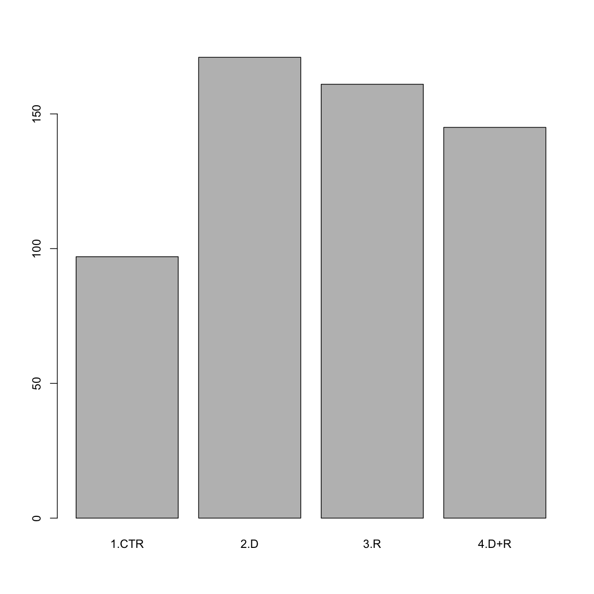

---
# Please do not edit this file directly; it is auto generated.
# Instead, please edit 10-factors.md in _episodes_rmd/
source: Rmd
title: "Factors"
teaching: 25
exercises: 20
questions:
- "How do I work with factors in R?"
objectives:
- "Describe what a factor is."
- "Convert between strings and factors."
- "Reorder and rename factors."
keypoints:
- ""
- ""
---

## Factors in R

When we did `str(tumor)` we saw that most of the columns are numeric.
The column `Grp`, however, isof the class `character`.
This column contains categorical data, that is, it can only take on
a limited number of values. To see this, use the `unique()` function.

~~~
unique(tumor$Grp)
~~~
{: .language-r}

~~~
[1] "1.CTR" "2.D"   "3.R"   "4.D+R"
~~~
{: .output}

As a reminder:
> Cells from a human glioma cell line were implanted in the flank of n=37 nude 
> mice and a subcutaneous tumor (xenograft) was allowed to grow. When a tumor 
> grew to around 40-60 $mm^3$, the animal was assigned to one of 4 experimental 
> groups (day 0):  
> 1) Control (CTR, n=8);  
> 2) Drug only (D, n=10);  
> 3) Radiation only (R, n=10); and  
> 4) Drug + Radiation (D+R, n=9).  
> The main outcome in xenograft experiments is the size (volume) of the tumor 
> over time. The study’s two main scientific aims were to 
> assess whether:  
> a. The drug has an effect on tumor growth.  
> b. The administration of the drug before radiation enhances the effect of the 
> latter on tumor growth.  

R has a special class for working with categorical data, called `factor`. 
Factors are very useful and actually contribute to making R particularly well 
suited to working with data. So we are going to spend a little time introducing 
them.

Once created, factors can only contain a pre-defined set of values, known as
*levels*. 
Factors are stored as integers associated with labels and they can be ordered or unordered. While factors look (and often behave) like character vectors, they are actually treated as integer vectors by R. So you need to be very careful when treating them as strings.

When importing a data frame with `read_csv()`, the columns that contain text are not automatically coerced (=converted) into the `factor` data type, but once we have loaded the data we can do the conversion using the `factor()` function: 

~~~
tumor$Grp <- factor(tumor$Grp)
~~~
{: .language-r}

We can see that the conversion has worked by using the `summary()` 
function again. This produces a table with the counts for each factor level:

~~~
summary(tumor$Grp)
~~~
{: .language-r}

~~~
1.CTR   2.D   3.R 4.D+R 
   97   171   161   145 
~~~
{: .output}

By default, R always sorts levels in alphabetical order. For
instance, if you have a factor with 2 levels:

~~~
direction <- factor(c("right", "left", "left", "right"))
~~~
{: .language-r}

R will assign `1` to the level `"left"` and `2` to the level `"right"` (because
`l` comes before `r`, even though the first element in this vector is
`"right"`). You can see this by using the function `levels()` and you can find the
number of levels using `nlevels()`:

~~~
levels(direction)
~~~
{: .language-r}

~~~
[1] "left"  "right"
~~~
{: .output}

~~~
nlevels(direction)
~~~
{: .language-r}

~~~
[1] 2
~~~
{: .output}

Sometimes, the order of the factors does not matter, other times you might want
to specify the order because it is meaningful (e.g., "low", "medium", "high"),
it improves your visualization, or it is required by a particular type of
analysis. Here, one way to reorder our levels in the `direction` vector would be:

~~~
direction # current order
~~~
{: .language-r}

~~~
[1] right left  left  right
Levels: left right
~~~
{: .output}

~~~
direction <- factor(direction, levels = c("right", "left"))
direction # after re-ordering
~~~
{: .language-r}

~~~
[1] right left  left  right
Levels: right left
~~~
{: .output}

In R's memory, these factors are represented by integers (1, 2), but are more
informative than integers because factors are self describing: `"left"`,
`"right"` is more descriptive than `1`, `2`. Which one is "right"?  You wouldn't
be able to tell just from the integer data. Factors, on the other hand, have
this information built in. It is particularly helpful when there are many levels
(like the `Grp` names in our example dataset).

>
> ## Exercise
>
> 1. Change the column `Grp` in the `tumor` data frame into a 
>    factor.  
> 2. Using the functions you learned before, can you find out:  
>      * How many were in group D?  
>      * How many levels there are? 
>       
> >
> > ## Solution
> > 
> > 
> > ~~~
> > tumor$Grp <- factor(tumor$Grp)
> > summary(tumor$Grp)
> > ~~~
> > {: .language-r}
> > 
> > 
> > 
> > ~~~
> > 1.CTR   2.D   3.R 4.D+R 
> >    97   171   161   145 
> > ~~~
> > {: .output}
> > 
> > 
> > 
> > ~~~
> > nlevels(tumor$Grp)
> > ~~~
> > {: .language-r}
> > 
> > 
> > 
> > ~~~
> > [1] 4
> > ~~~
> > {: .output}
> > 
> > {: .output}
> {: .solution}
{: .challenge}

### Converting factors

If you need to convert a factor to a character vector, you use
`as.character(x)`.

~~~
as.character(direction)
~~~
{: .language-r}

~~~
[1] "right" "left"  "left"  "right"
~~~
{: .output}

In some cases, you may have to convert factors where the levels appear as
numbers (such as concentration levels or years) to a numeric vector. For
instance, in one part of your analysis the years might need to be encoded as
factors (e.g., comparing average weights across years) but in another part of
your analysis they may need to be stored as numeric values (e.g., doing math
operations on the years). This conversion from factor to numeric is a little
trickier. The `as.numeric()` function returns the index values of the factor,
not its levels, so it will result in an entirely new (and unwanted in this case)
set of numbers. One method to avoid this is to convert factors to characters,
and then to numbers.

Another method is to use the `levels()` function. Compare:

~~~
year_fct <- factor(c(1990, 1983, 1977, 1998, 1990))
as.numeric(year_fct)               # Wrong! And there is no warning...
~~~
{: .language-r}

~~~
[1] 3 2 1 4 3
~~~
{: .output}

~~~
as.numeric(as.character(year_fct)) # Works...
~~~
{: .language-r}

~~~
[1] 1990 1983 1977 1998 1990
~~~
{: .output}

~~~
as.numeric(levels(year_fct))[year_fct]    # The recommended way.
~~~
{: .language-r}

~~~
[1] 1990 1983 1977 1998 1990
~~~
{: .output}

Notice that in the `levels()` approach, three important steps occur:

* We obtain all the factor levels using `levels(year_fct)`
* We convert these levels to numeric values using `as.numeric(levels(year_fct))`
* We then access these numeric values using the underlying integers of the
  vector `year_fct` inside the square brackets

### Renaming factors

When your data is stored as a factor, you can use the `plot()` function to get a
quick glance at the number of observations represented by each factor
level. Let's look at the number in each group.

~~~
## bar plot of the numbers in each group:
plot(tumor$Grp)
~~~
{: .language-r}

>
> ## Exercise
>
> 1. We have seen how data frames are created when using `read_csv()`, but
>   they can also be created by hand with the `data.frame()` function.  There are
>   a few mistakes in this hand-crafted `data.frame`. Can you spot and fix them?
>   Don't hesitate to experiment!
>
>     
>     ~~~
>     animal_data <- data.frame(
>               animal = c(dog, cat, sea cucumber, sea urchin),
>               feel = c("furry", "squishy", "spiny"),
>               weight = c(45, 8 1.1, 0.8)
>               )
>     ~~~
>     {: .language-r}
>
> 2. Can you predict the class for each of the columns in the following example?
>    Check your guesses using `str(country_climate)`:
>      * Are they what you expected?  Why? Why not?
>      * What would you need to change to ensure that each column had the accurate data type?
>
>     
>     ~~~
>     country_climate <- data.frame(
>            country = c("Canada", "Panama", "South Africa", "Australia"),
>            climate = c("cold", "hot", "temperate", "hot/temperate"),
>            temperature = c(10, 30, 18, "15"),
>            northern_hemisphere = c(TRUE, TRUE, FALSE, "FALSE"),
>            has_kangaroo = c(FALSE, FALSE, FALSE, 1)
>            )
>     ~~~
>     {: .language-r}
>
> > ## Solution
> >
> > 1. * missing quotations around the names of the animals  
> > * missing one entry in the `feel` column (probably for one of the furry animals)  
> > * missing one comma in the `weight` column  
> > 2. `country`, `climate`, `temperature`, and `northern_hemisphere` are
> >  characters; `has_kangaroo` is numeric  
> >  * using `factor()` one could replace character columns with factors columns  
> >  * removing the quotes in `temperature` and `northern_hemisphere` and replacing 1
> >  by TRUE in the `has_kangaroo` column would give what was probably intended   
> {: .solution}
{: .challenge}

The automatic conversion of data type is sometimes a blessing, sometimes an
annoyance. Be aware that it exists, learn the rules, and double check that data
you import in R are of the correct type within your data frame. If not, use it
to your advantage to detect mistakes that might have been introduced during data
entry (for instance, a letter in a column that should only contain numbers).

Learn more in this [RStudio tutorial](https://support.rstudio.com/hc/en-us/articles/218611977-Importing-Data-with-RStudio)
