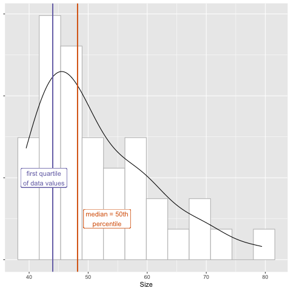

---
# Please do not edit this file directly; it is auto generated.
# Instead, please edit 12-descriptive-calculations.md in _episodes_rmd/
source: Rmd
title: "Descriptive Calculations"
teaching: 20
exercises: 20
questions:
- "How do I obtain summary statistics for data?"
- "What do the mean, median, and standard deviation of a data set summarize?"
objectives:
- "Summarize specific observations from data."
- "Group observations and summarize."
- "Differentiate between measures of central tendency and dispersion."
keypoints:
- ""
- ""
---

# Descriptive Calculations

## Building the pipeline

New script, clear your environment, re-load your libraries

~~~
library(tidyverse)
~~~
{: .language-r}

Load the filtered data set created previously that contains days 0 or 13 only. 

~~~
tumor_subset <- read_csv("../data/tumor_filtered.csv")
~~~
{: .language-r}

Have a look at the data subset.

~~~
tumor_subset
~~~
{: .language-r}

~~~
# A tibble: 60 x 4
   Group    ID   Day   Size
   <dbl> <dbl> <dbl>  <dbl>
 1     1   101     0   41.8
 2     1   101    13 1030. 
 3     1   102     0   79.4
 4     1   102    13  619. 
 5     1   103     0   44.8
 6     1   104     0   67.7
 7     1   105     0   54.7
 8     1   105    13 1699. 
 9     1   106     0   60  
10     1   107     0   46.8
# … with 50 more rows
~~~
{: .output}

## Summary statistics
Descriptive statistics summarize and organize characteristics of a data set. The first step of statistical analysis is to describe characteristics of the responses, such as the average of one variable (e.g., age), or the relation between two variables (e.g., age and weight). Inferential statistics, the next step in an analysis, helps to determine whether data confirms or refutes your hypothesis and whether it is generalizable to a larger population. We focus on descriptive statistics here with some statistical summaries of the filtered data. `pull` extracts a single column of data in the same way the the `$` operator specifies a column. `pull` is a verb though, and reads more easily in piped operations like this one.

Filter out observations for day 0 only and look at the Size variable.

~~~
tumor_subset %>%
  filter(Day == 0) %>%
  pull(Size)
~~~
{: .language-r}

~~~
 [1] 41.8 79.4 44.8 67.7 54.7 60.0 46.8 49.4 49.1 60.6 41.5 46.8 39.5 53.5 43.5
[16] 64.4 47.5 71.7 44.1 42.1 42.5 56.9 46.7 51.2 44.0 59.8 40.7 58.2 41.3 53.5
[31] 45.8 48.2 47.7 69.2 43.9 59.3 51.1
~~~
{: .output}

The mean is one statistical summary showing the _central tendency_ of the data. It is the most commonly used measure of central tendency, however, it is sensitive to _outliers_. Extreme values pull the mean toward them and have a disproportional effect on its value. The median value is another measure of central tendency as
well as a measure of _position_. This value lies directly in the center of the ordered data with half of the values above and half below it. It is not 
sensitive to extreme values - only its rank in the ordered values is considered. 

Summarize tumor size for day 0 with the mean.

~~~
tumor_subset %>%
  filter(Day == 0) %>%
  pull(Size) %>%
  mean()
~~~
{: .language-r}

~~~
[1] 51.59189
~~~
{: .output}

Find mean tumor size for day 0 for group 1.

~~~
tumor_subset %>%
  filter(Group == 1, Day == 0) %>%
  pull(Size) %>%
  mean()
~~~
{: .language-r}

~~~
[1] 55.575
~~~
{: .output}

Find mean tumor size for day 0 for group 2.

~~~
tumor_subset %>%
  filter(Group == 2, Day == 0) %>%
  pull(Size) %>%
  mean()
~~~
{: .language-r}

~~~
[1] 51.81
~~~
{: .output}

Find mean tumor size for day 0 for group 3.

~~~
tumor_subset %>%
  filter(Group == 3, Day == 0) %>%
  pull(Size) %>%
  mean()
~~~
{: .language-r}

~~~
[1] 48.62
~~~
{: .output}

Find mean tumor size for day 0 for group 4.

~~~
tumor_subset %>%
  filter(Group == 4, Day == 0) %>%
  pull(Size) %>%
  mean()
~~~
{: .language-r}

~~~
[1] 51.11111
~~~
{: .output}

What are the unique group numbers?

~~~
tumor_subset %>%
  pull(Group) %>%
  unique()
~~~
{: .language-r}

~~~
[1] 1 2 3 4
~~~
{: .output}

## Groupby operations
Use `group_by` and `summarize` to view group means for all groups.

~~~
tumor_subset %>%
  filter(Day == 0) %>%
  group_by(Group) %>%
  summarize(avg_size = mean(Size))
~~~
{: .language-r}

~~~
# A tibble: 4 x 2
  Group avg_size
  <dbl>    <dbl>
1     1     55.6
2     2     51.8
3     3     48.6
4     4     51.1
~~~
{: .output}

> ## Comparing mean with median.
>
> Repeat the previous summary substituting the median for the mean.  
> 1). What do you notice when you compare the mean and median values for each 
> group?   
> 2). What would cause the differences in the mean and median values for each 
> group?   
> 3). How might you check your answer to number 2 above? 
> 
> > ## Solution
> >
> > ~~~
> > tumor_subset %>%
> >   filter(Day == 0) %>%
> >   group_by(Group) %>%
> >   summarize(median_size = median(Size))
> > ~~~
> > {: .output}
> >
> > 1). The median values are smaller than the mean values for each group.    
> > 2). Since the median is not sensitive to outliers and is smaller than the 
> > mean for each group, it appears that there are large sizes in each group
> > that pull the mean toward them.   
> > 3) You could list all size values for each group to see if there are very
> > large values that pull the mean toward them. The mean values are between 48 
> > and 56, so values much above this will strongly influence the mean. You can
> > look at all values by group.
> > ~~~
> > tumor_subset %>%
> > filter(Day == 0) %>%
> > group_by(Group) %>%
> > pull(Size, Group)
> > ~~~
> > {: .output}
> > If you only want to see the maximum value for each group, you can use `max`.
> > ~~~
> > tumor_subset %>%
> > filter(Day == 0) %>%
> > group_by(Group) %>%
> > summarize(max_value = max(Size))
> > ~~~
> > {: .output}
> > Each group has a maximum value well outside of the range of group means.
> {: .solution}
{: .challenge}

Mean and median both summarize the center of the data. Median lies directly at 
center of the ordered data values - it lies at the midpoint of these values and
is a measure of position. 
The _quantile_ defines a specific part of a data set above or below some limit. 
For example, quartiles divide a data set into fourths, and percentiles by 
100ths. The median is the 50th percentile of the data - half lie above this 
value and half below. `quantile` takes an argument `probs` that gives the probability of values falling beneath a specific quantile. For example, `probs = .25` means that 25% of the values will be less than this quantile. This is the first quarter, or quartile, of the data.  

~~~
tumor_subset %>% 
  filter(Day == 0) %>% 
  summarize(quartile_1 = quantile(Size, probs = .25))
~~~
{: .language-r}

~~~
# A tibble: 1 x 1
  quartile_1
       <dbl>
1         44
~~~
{: .output}

_Standard deviation_ measures the spread of the data. This summary statistic
measures the _dispersion_ or _variability_ of the data. A small standard deviation indicates that data values tend to stay closer to the mean, while a large standard deviation indicates greater spread of data values away from the mean. Measuring standard deviation helps to describe the expected distance between data values. It is also a measure of how representative data values are of the entire distribution. For a normal distribution, 68% of the data values lie within one standard deviation of the mean.  

~~~
# Find the standard deviation for day 0 for all groups.
sd_size <- tumor_subset %>% 
  filter(Day == 0) %>% 
  summarise(sd_size = sd(Size))
~~~
{: .language-r}

We can further explore mean, standard deviation, and first quartile by calculating each for groups 1 to 4.

~~~
tumor_subset %>%
  group_by(Group, Day) %>%
  summarize(avg_size = mean(Size),
            sd_size = sd(Size),
            q1 = quantile(Size, probs = .25)
            )
~~~
{: .language-r}

~~~
`summarise()` has grouped output by 'Group'. You can override using the `.groups` argument.
~~~
{: .output}

~~~
# A tibble: 8 x 5
# Groups:   Group [4]
  Group   Day avg_size sd_size     q1
  <dbl> <dbl>    <dbl>   <dbl>  <dbl>
1     1     0     55.6   12.9    46.3
2     1    13   1597.   764.   1030. 
3     2     0     51.8   10.6    44.3
4     2    13    453.   287.    357. 
5     3     0     48.6    7.30   42.9
6     3    13    934.   510.    571. 
7     4     0     51.1    8.64   45.8
8     4    13    768.   314.    600. 
~~~
{: .output}

> ## Measures of variability and position
>
> 1). For each day, which  group  has the largest mean tumor size? the largest 
> variability? Which has the smallest mean size? the smallest variability?   
> 2). For these combinations of group and day, what values do 25% of the data
> values fall under?   
> 
> > ## Solution
> >
> > 1). Group 1 on day 0 has the greatest mean size and standard deviation.  
> > Group 1 on day 13 also has the greatest mean size and standard deviation.  
> > Group 3 on day 0 has the smallest mean size and variability. For day 13  
> > Group 2 has the smallest mean size and variability.  
> > 2). Group 1, day 0: 25% of data values are less than 46.3.   
> > Group 1, day 13: 25% < 1030.4   
> > Group 3, day 0: 25% < 42.875  
> > Group 2, day 13: 25% < 357.225  
> {: .solution}
{: .challenge}
