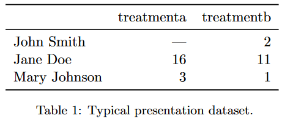
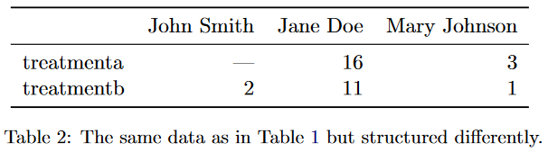
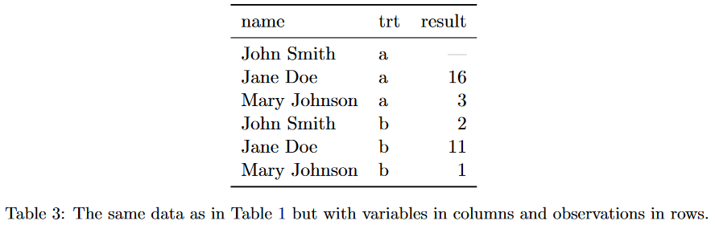
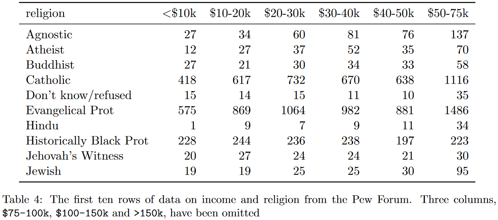
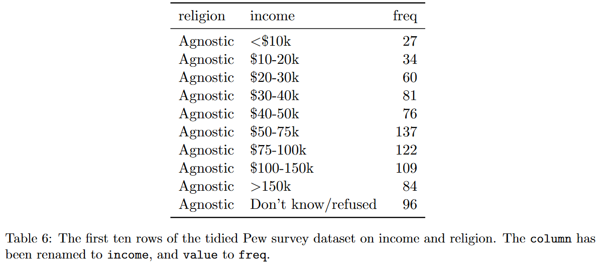
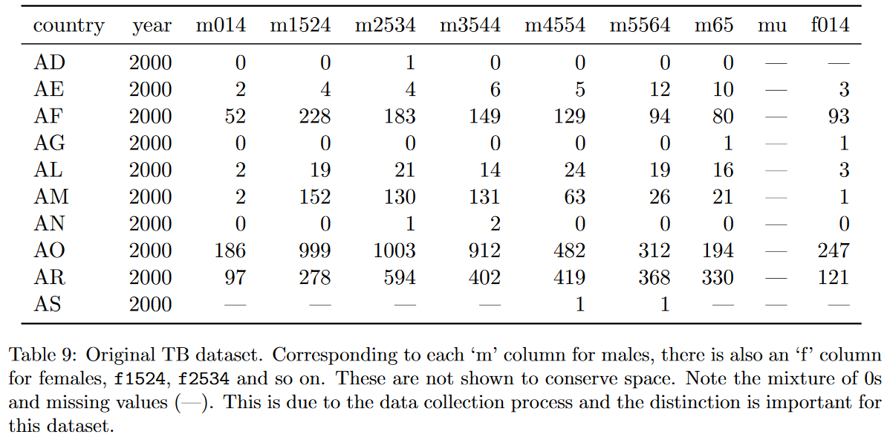
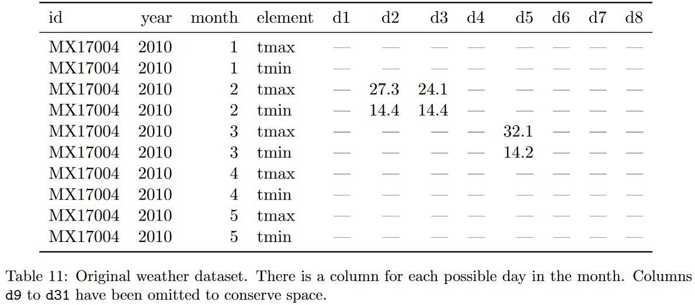
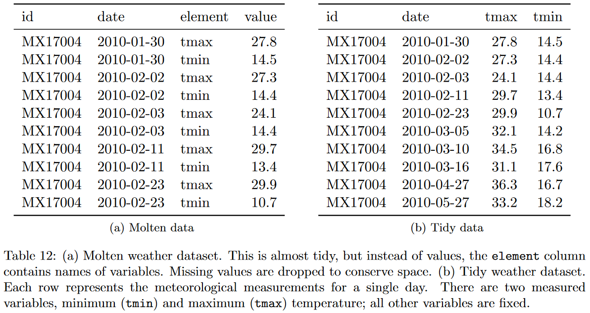

---
# Please do not edit this file directly; it is auto generated.
# Instead, please edit 14-cleaning-data.md in _episodes_rmd/
source: Rmd
title: "Cleaning data"
teaching: 0
exercises: 0
questions:
- "How do I re-organize and clean data in R?"
objectives:
- "Transpose data from wide to long format."
- "Replace variable values with variable names as column headers."
- "Split multiple variables stored in the same column."
- "Re-organize data stored in both rows and columns."
keypoints:
- ""
- ""
---

~~~
library(tidyverse)
~~~
{: .language-r}

# Clean Data (Tidy)

## Introduction {#tidy-intro}

Now that we have seen how to import a dataset as a dataframe object,
we can start the process of "cleaning" it.
We saw in the "Spreadsheets" Chapter (\@ref(spreadsheets)) that data could come in different
formats and "shapes" that serve different purposes.
Our Goal now is to start the process of making our dataset "clean"
by making it more amenable to different visualization and modeling methods.
Cleaning, processing, wrangling, tidying, etc are all synonyms you may have heard being used
for this process
(others include screaming, cursing, and walking away).

This chapter is one of the most important concepts in data processing.
It creates a standardized way to talk about a "clean" dataset and structures how you can process your data.
It also serves as a great common ground to move between different programming languages,
since the data manipulation steps are common throughout different languages,
only the actual programming syntax will change.

## What is tidy data?

When we want to "clean" data,
there needs to be some standard way to describe what we mean and some goal to work towards when we are cleaning our dataset.
[Hadley Wickham's 2014 "Tidy Data" paper in the Journal of Statistical Software](https://vita.had.co.nz/papers/tidy-data.pdf)
gives us a formal definition we can use to describe the "shape" of our data.
We will use examples from the paper to define "tidy data".

Below is a duplicate of "Tidy Data's" Table 1.
It shows an example dataset where each row represents a person and columns for some imaginary experiment's treatment values.

This is a space efficient representation of our data.
It allows the reader to quickly glance the data values and perform comparisons in their heads.

We can also **transpose** the values of our dataset so the rows and columns are interchanged.

Other than making the dataset "wider", we can still do the same set of quick comparisons in this data representation.
These two "shapes" of the same dataset are good for presentations when data needs to be quickly interpreted by a user.
However, remember the `group_by` function we first used in Chapter \@ref(descriptives-intro),
we are unable to perform those aggregate summary statistics in the way our dataset is formatted.

If we organize the data into another shape:

We can see it makes doing treatment comparisons more difficult as a reader.
However,
we can now answer the question of "what is the average value for each treatment?"
and from a statistical analysis point of view,
we can now answer the question of "how does treatment affect the result?".
This last example is the "tidy" or "clean" form of our example dataset.

So what aspects of the last table example make it tidy?
The "Tidy Data" paper defines "tidy data" as having 3 features

- Each variable forms a column
- Each observation forms a row
- Each cell is a single measurement

If we compare the "tidy data" definition, we can see how the first 2 table examples violate the "tidy data" definition.
We want a "variable" for person, treatment, and value, not each column containing a single treatment's value or a single person's value.
The unit of interest our dataset stores is a *person's* treatment value,
so each **row** should represent a person.

This now gives us the framework to process data so we can begin working with disparate data sets.

Now that data can be consistently formatted, when we describe a dataset as being "tidy",
we know what that means.
This also makes creating tools and analysis pipelines easier since the shape of our data will be consistent.

:::{.tldr}
Once you have a tidy dataset, you can easily transform it back to a more presentation friendly view.
:::

## Common data problems

We've discussed what makes data "tidy", but what about *actually* doing it?
Most of the "messy" data sets we see in the world can actually be described as having the same "problems".

- Column headers are values, not variable names
- Multiple variables stored in one column
- Variables are stored in both rows and columns

We will discuss each point in more detail in the following sections.

## Column headers are values, not variable names

This dataset from the Pew Research Center explores the relationship between income and religion in the US.
It shows the religion and frequency for a particular income bracket.

We listed 3 variables the table depicts, but those 3 variables are not the variables (i.e., columns) of the dataset.
The values of the "income" variable are actually the columns of our dataset.
This is the "column headers are values, not variable names" problem with our current dataset.
If we wanted to make it tidy, such that we had 3 columns (religion, income, and frequency),
the data set would look as follows:

The first table is sometimes called the **wide** format
since it has more **columns** and wider to print on the screen,
and the tidy version of the data set example is sometimes called the **long** format
since it has more **rows** and is longer to print on the screen.

Let's go through an example by loading up the `tidyverse` library and our dataset.
Note that the code below has suppressed the message output from loading the library and reading in the dataset.

~~~
library(tidyverse)
tumor <- read_csv("../data/tumorgrowth_long.csv")
~~~
{: .language-r}

This dataset comes from the [`medicaldata` R package](https://github.com/higgi13425/medicaldata),
curated by Dr. Peter Higgins, M.D. in the
[IBD Research Group at the University of Michigan Medical School](http://www.med.umich.edu/higginslab/).

The dataset we loaded is a modified version of the "tumorgrowth" dataset in the `medicaldata` package.
It shows the treatment group for a particular sample and its size ($mm^3$) over time (days).

> Cells from a human glioma cell line were implanted in the flank of n=37 nude mice and a subcutaneous tumor (xenograft) was allowed to grow.
> When a tumor grew to around 40-60mm^3, the animal was assigned to one of 4 experimenal groups...
> The main outcome in xenograft experiments is the size (volume) of the tumor over time.

You can read more about the dataset and study in the codebook for
["Mixed-Effects Modeling of Tumor Growth in Animal Xenograft Experiments"](https://github.com/higgi13425/medicaldata/blob/master/description_docs/tumorgrowth_desc.pdf)

~~~
tumor
~~~
{: .language-r}

~~~
# A tibble: 37 x 32
   Group Grp      ID   `0`   `1`   `2`   `3`   `4`   `5`   `6`   `7`   `8`   `9`
   <dbl> <chr> <dbl> <dbl> <dbl> <dbl> <dbl> <dbl> <dbl> <dbl> <dbl> <dbl> <dbl>
 1     1 1.CTR   101  41.8  NA    NA    85   114    162.  178.  325    NA    NA 
 2     1 1.CTR   102  79.4 110.   NA    NA   201.   255.  349.  358.  670    NA 
 3     1 1.CTR   103  44.8  67.5  55.8  82.8 107.    NA    NA   310.  356.  555.
 4     1 1.CTR   104  67.7  92.4  77.7 107.  147.    NA    NA   226.  285.  542.
 5     1 1.CTR   105  54.7  NA    NA    61.1  75.3  112.  118.  165.   NA    NA 
 6     1 1.CTR   106  60    74.2  98.9 103.  106.    NA    NA   166.  269.  478.
 7     1 1.CTR   107  46.8  NA    NA    NA   163.   264.  253.  419.   NA    NA 
 8     1 1.CTR   108  49.4  NA    NA    NA   123.   286.  485.  584.   NA    NA 
 9     2 2.D     201  49.1  NA    NA    65.6  88.9  135.  172.  177.   NA    NA 
10     2 2.D     202  60.6  75.7  75.8  NA   159.    NA    NA   306.  397.  398.
# … with 27 more rows, and 19 more variables: 10 <dbl>, 11 <dbl>, 12 <dbl>,
#   13 <dbl>, 14 <dbl>, 15 <dbl>, 16 <dbl>, 17 <dbl>, 18 <dbl>, 19 <dbl>,
#   20 <dbl>, 21 <dbl>, 22 <dbl>, 23 <dbl>, 24 <dbl>, 25 <dbl>, 26 <dbl>,
#   27 <dbl>, 28 <dbl>
~~~
{: .output}

Here we have the "column headers are values, not variable names" issue just like the PEW religion dataset.
The "day" variable is represented as separate columns in our dataset.
In order to "tidy" our dataset we can use the `pivot_longer` function.
This operation is sometimes also referred to as `gather` or `melt`.

We pass `pivot_longer` the data set we want to tidy, `tumor`.
Then, we want to select the columns that represent a variable to turned into a column.
Here we can use a fancier way to refer to a range of columns (this is known as **`tidyselect`**) to select all the columns
from the one labeled `0` to the last column of our dataset.
Next, we provide the new column names from the selected columns using the `names_to` parameter,
and the new column name for the values using the `values_to` parameter.
Any of the columns not specified in the selection will be treated as an "ID" and not be changed.

~~~
tumor_tidy <- tumor %>%
  pivot_longer(`0`:last_col(), names_to = "day", values_to = "size")
tumor_tidy
~~~
{: .language-r}

~~~
# A tibble: 1,073 x 5
   Group Grp      ID day    size
   <dbl> <chr> <dbl> <chr> <dbl>
 1     1 1.CTR   101 0      41.8
 2     1 1.CTR   101 1      NA  
 3     1 1.CTR   101 2      NA  
 4     1 1.CTR   101 3      85  
 5     1 1.CTR   101 4     114  
 6     1 1.CTR   101 5     162. 
 7     1 1.CTR   101 6     178. 
 8     1 1.CTR   101 7     325  
 9     1 1.CTR   101 8      NA  
10     1 1.CTR   101 9      NA  
# … with 1,063 more rows
~~~
{: .output}

Another representation the relationship between wide and long data can be seen here from Garrick Aden-Buie's "tidyexplain" repository.

Now that we have "tidied" our dataset, we can now calculate descriptive statistics.
For example, we can ask how does the is the average tumor volume change for each treatment group across the days?

~~~
tumor_tidy %>%
  group_by(Group, day) %>%
  summarize(avg_size = mean(size, na.rm = TRUE)) %>% # some values are missing
  mutate(day = as.numeric(day)) %>% # treat the day as a number
  arrange(Group, day) # sort the values by group and day
~~~
{: .language-r}

~~~
`summarise()` has grouped output by 'Group'. You can override using the `.groups` argument.
~~~
{: .output}

~~~
# A tibble: 116 x 3
# Groups:   Group [4]
   Group   day avg_size
   <dbl> <dbl>    <dbl>
 1     1     0     55.6
 2     1     1     86.1
 3     1     2     77.5
 4     1     3     87.9
 5     1     4    130. 
 6     1     5    216. 
 7     1     6    277. 
 8     1     7    319. 
 9     1     8    395. 
10     1     9    525. 
# … with 106 more rows
~~~
{: .output}

> ## Exercise
> > 1. Load the 
> [cytomegalovirus dataset](https://github.com/higgi13425/medicaldata/blob/master/data/cytomegalovirus.rda) 
> by clicking the **Download** button and loading the data into RStudio. Check the Environment tab in the upper
> right panel for an object named `cytomegalovirus`. You can 
> [read more about this data set](https://github.com/higgi13425/medicaldata/blob/master/description_docs/cytomegalovirus_desc.pdf)
> containing measurements from 64 patients who underwent hematopoietic stem cell transplant.
> 1.  Tidy the dataset using the `pivot_longer` function
> 
> ~~~
> cytomegalovirus %>%
> pivot_longer(____, names_to = ____, values_to = ____)
> ~~~
> {: .language-r}
> 
> > ## Solution
> > 
> {: .solution}
{: .challenge}

## Multiple variables stored in one column

Another data problem is when multiple bits of information are encoded into the same cell.
The "Tidy Data" paper uses the a Turberculosis (TB) data set from the World Health Organization (WHO),
showing the counts of TB cases by country, year, and demographic group.

Combining multiple bits of information in a column is fairly common in medical data sets.
If we look at just the column names,
we can see that we have a similar problem from the previous example (Section TODO).
So we would fix that problem first (Panel A in Figure TODO).
From there we can "split" the gender information from the "age" information to separate from one another and create separate columns
(Panel B in Figure TODO).

Let's go through this example from the paper ourselves.

~~~
# read the tb dataset
tb <- read_csv("../data/tb_long.csv")
tb
~~~
{: .language-r}

~~~
# A tibble: 201 x 18
   country  year  m014 m1524 m2534 m3544 m4554 m5564   m65 mu     f014 f1524
   <chr>   <dbl> <dbl> <dbl> <dbl> <dbl> <dbl> <dbl> <dbl> <lgl> <dbl> <dbl>
 1 AD       2000     0     0     1     0     0     0     0 NA       NA    NA
 2 AE       2000     2     4     4     6     5    12    10 NA        3    16
 3 AF       2000    52   228   183   149   129    94    80 NA       93   414
 4 AG       2000     0     0     0     0     0     0     1 NA        1     1
 5 AL       2000     2    19    21    14    24    19    16 NA        3    11
 6 AM       2000     2   152   130   131    63    26    21 NA        1    24
 7 AN       2000     0     0     1     2     0     0     0 NA        0     0
 8 AO       2000   186   999  1003   912   482   312   194 NA      247  1142
 9 AR       2000    97   278   594   402   419   368   330 NA      121   544
10 AS       2000    NA    NA    NA    NA     1     1    NA NA       NA    NA
# … with 191 more rows, and 6 more variables: f2534 <dbl>, f3544 <dbl>,
#   f4554 <dbl>, f5564 <dbl>, f65 <dbl>, fu <lgl>
~~~
{: .output}

Our first step is to make our data long using the `pivot_longer` function.
Here we are using a different method to select our columns using the `starts_with` selector.
You can also use the previous range selector as well.

~~~
tb_long <- tb %>%
  pivot_longer(starts_with(c('m', 'f')))
tb_long
~~~
{: .language-r}

~~~
# A tibble: 3,216 x 4
   country  year name  value
   <chr>   <dbl> <chr> <dbl>
 1 AD       2000 m014      0
 2 AD       2000 m1524     0
 3 AD       2000 m2534     1
 4 AD       2000 m3544     0
 5 AD       2000 m4554     0
 6 AD       2000 m5564     0
 7 AD       2000 m65       0
 8 AD       2000 mu       NA
 9 AD       2000 f014     NA
10 AD       2000 f1524    NA
# … with 3,206 more rows
~~~
{: .output}

Now that we have the "long" dataset, we can use the `separate` function to separate out the information in that column.

~~~
tb_tidy <- tb_long %>%
  separate(name, into = c("sex", "age_group"), sep = 1)
tb_tidy
~~~
{: .language-r}

~~~
# A tibble: 3,216 x 5
   country  year sex   age_group value
   <chr>   <dbl> <chr> <chr>     <dbl>
 1 AD       2000 m     014           0
 2 AD       2000 m     1524          0
 3 AD       2000 m     2534          1
 4 AD       2000 m     3544          0
 5 AD       2000 m     4554          0
 6 AD       2000 m     5564          0
 7 AD       2000 m     65            0
 8 AD       2000 m     u            NA
 9 AD       2000 f     014          NA
10 AD       2000 f     1524         NA
# … with 3,206 more rows
~~~
{: .output}

Technically the `pivot_longer` function provides the ability to do the pivot and separation in a single step,
but this way we see the parts broken down into separate components.

:::{.tldr}
When curating your own data set, leave yourself a bread-trail to process your data later on.
:::

## Variables are stored in both rows and columns

The last common data problem we can have is having variables stored in both rows and columns.
This problem isn't usually noticeable at first glance,
and is only realized as you start fixing problems one step at a time.

The first thing we'll see is that we have the *same* columns as variables problem we've been having this entire time.
So we can fix the variables being stored in the columns the same way as we have been doing.

Only after we fix the column problem,
do we see that somthing is a little off about our dataset.
The weather information is usually report at the "day" level.
That is, every observation is a day, and we should have a maximum and minimum temperature value for each day.
However, in the initial "long" data set format,
we see that the data is stored by date and element values.

Another symptom of data being stored in rows is a lot of repeated column values with only a few changes in cells between rows.
The way we fix the "variables stored in row" problem is to perform the "opposite" of the `pivot_longer` function we have been using.

We can load up the CMS utilization dataset that gives us CMS utilization rates by state, demographics, year, and measurement.

~~~
cms <- read_csv("../data/cms_utilization.csv")
cms
~~~
{: .language-r}

~~~
# A tibble: 3,456 x 17
   state  state_fips variable   sex   age_group num_chronic `2007` `2008` `2009`
   <chr>  <chr>      <chr>      <chr> <chr>     <chr>        <dbl>  <dbl>  <dbl>
 1 Alaba… 01         Per Capit… males Less tha… 0 to 1       1594.  1640.  1680.
 2 Alaba… 01         Per Capit… males Less tha… 2 to 3       6269.  6484.  6339.
 3 Alaba… 01         Per Capit… males Less tha… 4 to 5      12902. 13400. 13713.
 4 Alaba… 01         Per Capit… males Less tha… 6+          31169. 32837. 33190.
 5 Alaba… 01         Per Capit… males Less tha… 0 to 1       1745.  1794.  1829.
 6 Alaba… 01         Per Capit… males Less tha… 2 to 3       6752.  7035.  6816.
 7 Alaba… 01         Per Capit… males Less tha… 4 to 5      13796. 14385. 14596.
 8 Alaba… 01         Per Capit… males Less tha… 6+          32779. 34641. 34879.
 9 Alaba… 01         ED Visits… males Less tha… 0 to 1        398.   410.   411.
10 Alaba… 01         ED Visits… males Less tha… 2 to 3        865.   865.   852.
# … with 3,446 more rows, and 8 more variables: 2010 <dbl>, 2011 <dbl>,
#   2012 <dbl>, 2013 <dbl>, 2014 <dbl>, 2015 <dbl>, 2016 <dbl>, 2017 <dbl>
~~~
{: .output}

We can make our data "long" just like before.

~~~
cms_long <- cms %>%
  pivot_longer(`2007`:last_col(), names_to = "year")
cms_long
~~~
{: .language-r}

~~~
# A tibble: 38,016 x 8
   state  state_fips variable         sex   age_group    num_chronic year  value
   <chr>  <chr>      <chr>            <chr> <chr>        <chr>       <chr> <dbl>
 1 Alaba… 01         Per Capita Spen… males Less than 6… 0 to 1      2007  1594.
 2 Alaba… 01         Per Capita Spen… males Less than 6… 0 to 1      2008  1640.
 3 Alaba… 01         Per Capita Spen… males Less than 6… 0 to 1      2009  1680.
 4 Alaba… 01         Per Capita Spen… males Less than 6… 0 to 1      2010  1599.
 5 Alaba… 01         Per Capita Spen… males Less than 6… 0 to 1      2011  1612.
 6 Alaba… 01         Per Capita Spen… males Less than 6… 0 to 1      2012  1695.
 7 Alaba… 01         Per Capita Spen… males Less than 6… 0 to 1      2013  1729.
 8 Alaba… 01         Per Capita Spen… males Less than 6… 0 to 1      2014  1791.
 9 Alaba… 01         Per Capita Spen… males Less than 6… 0 to 1      2015  1868.
10 Alaba… 01         Per Capita Spen… males Less than 6… 0 to 1      2016  1736.
# … with 38,006 more rows
~~~
{: .output}

Now when we want to use the `pivot_wider` function, we want to specify the column we want to pivot.
During this process, every unique value in this column will become a separate column.
The next thing we need to provide is the column that will be used to fill in the body of the cells when the column is pivoted.

~~~
cms_tidy <- cms_long %>%
  pivot_wider(names_from = variable, values_from = value)
cms_tidy
~~~
{: .language-r}

~~~
# A tibble: 9,504 x 10
   state  state_fips sex   age_group     num_chronic year  `Per Capita Spending…
   <chr>  <chr>      <chr> <chr>         <chr>       <chr>                 <dbl>
 1 Alaba… 01         males Less than 65… 0 to 1      2007                  1594.
 2 Alaba… 01         males Less than 65… 0 to 1      2008                  1640.
 3 Alaba… 01         males Less than 65… 0 to 1      2009                  1680.
 4 Alaba… 01         males Less than 65… 0 to 1      2010                  1599.
 5 Alaba… 01         males Less than 65… 0 to 1      2011                  1612.
 6 Alaba… 01         males Less than 65… 0 to 1      2012                  1695.
 7 Alaba… 01         males Less than 65… 0 to 1      2013                  1729.
 8 Alaba… 01         males Less than 65… 0 to 1      2014                  1791.
 9 Alaba… 01         males Less than 65… 0 to 1      2015                  1868.
10 Alaba… 01         males Less than 65… 0 to 1      2016                  1736.
# … with 9,494 more rows, and 3 more variables:
#   Per Capita Spending-Standardized ($) <dbl>,
#   ED Visits per 1,000 Beneficiaries <dbl>,
#   Hospital Readmissions-Percentage (%) <dbl>
~~~
{: .output}

## Summary {#tidy-summary}

Tidy data is a common "format" that lets data be interoperable with all of the analytics tools.
Once your data is "tidy", you can easily create summary statistics, plots, and fit models.

Most of your data processing phase will be spent wrangling data into a tidy format.

But once it's there, you can easily create other data products from them, including non-tidy data for presentations.

## Additional Resources  {#tidy-resources}

- Tidy data paper:
https://vita.had.co.nz/papers/tidy-data.html
- More code heavy R documentation on tidy data:
https://cran.r-project.org/web/packages/tidyr/vignettes/tidy-data.html
- r4ds Tidy Data Chapter:
https://r4ds.had.co.nz/tidy-data.html
