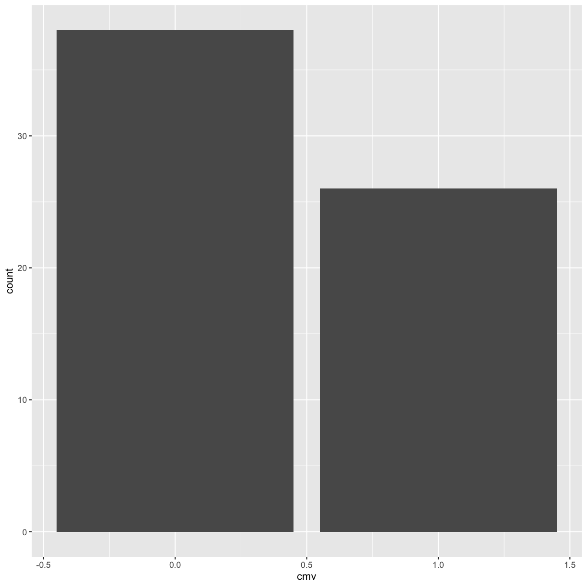
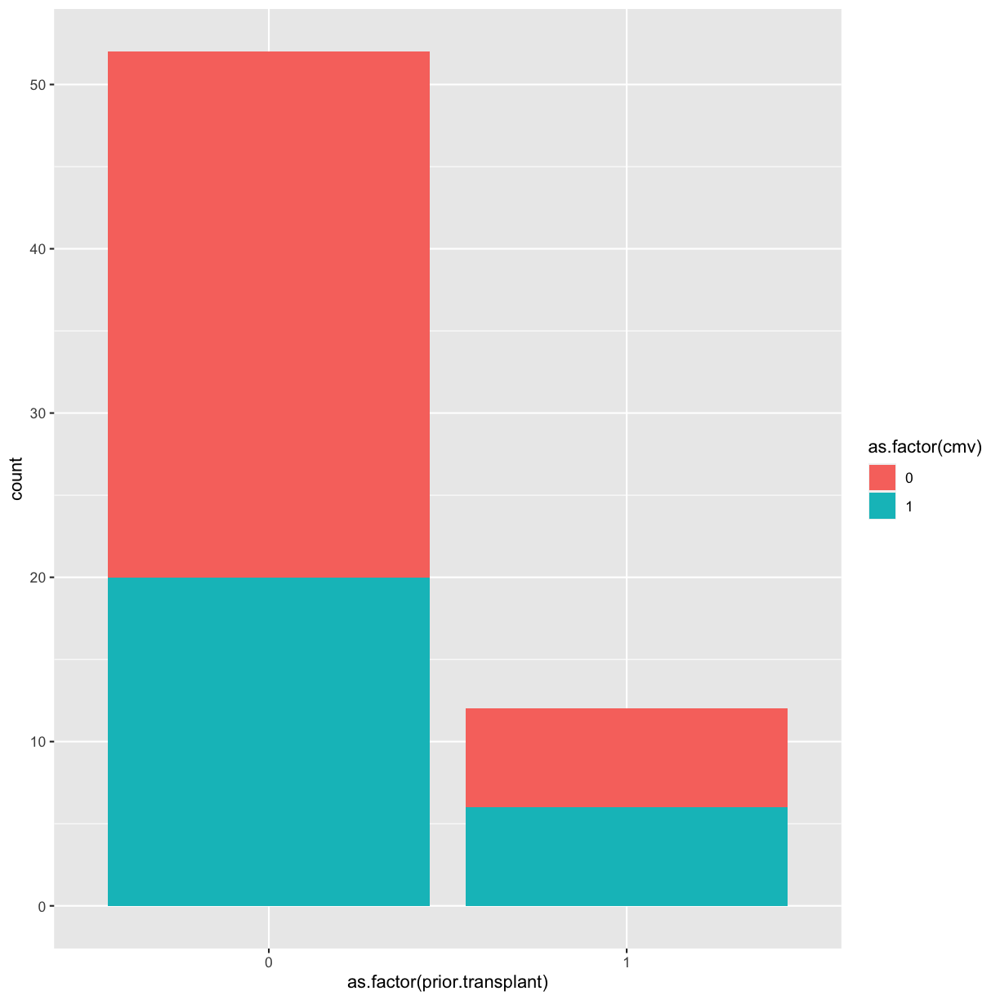
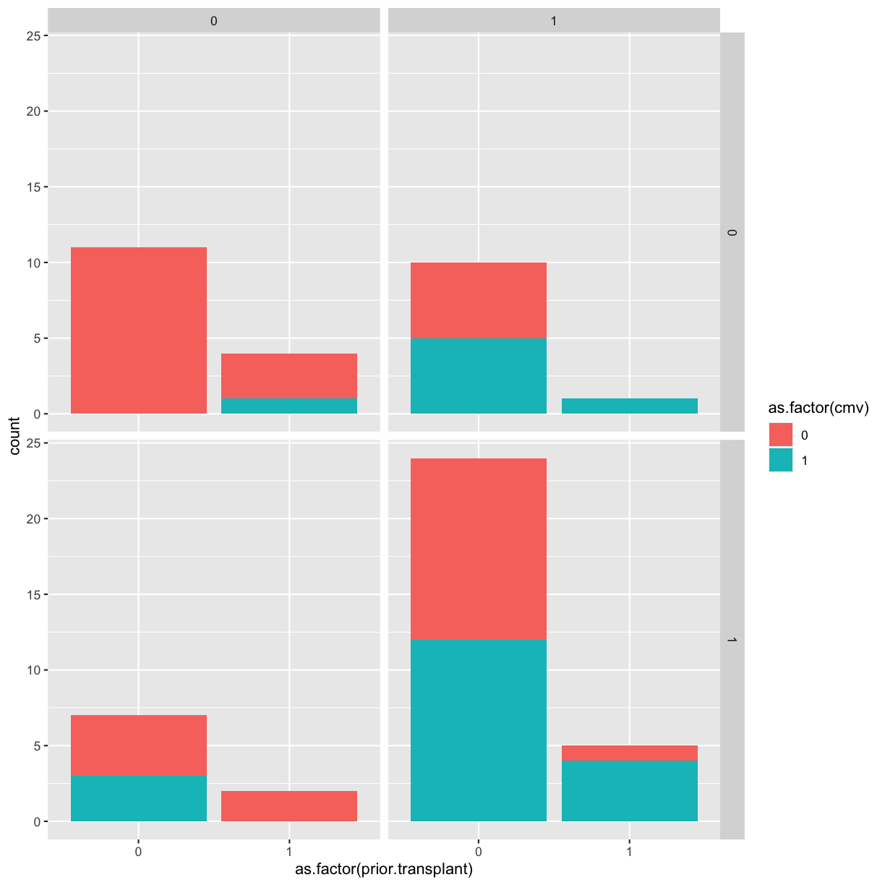

---
# Please do not edit this file directly; it is auto generated.
# Instead, please edit 15-visualization.md in _episodes_rmd/
source: Rmd
title: "Data visualization"
teaching: 0
exercises: 0
questions:
- "How do I visualize data in R?"
objectives:
- "Explore differences between continuous, discrete, nominal, ordinal, and binary data values."
- "Learn to implement a grammar of graphics."
- "Explore plots for different kinds of data values."
- "Build a plot layer by layer."
keypoints:
- ""
- ""
---

# Visualization (Intro)

## Introduction {#vis-intro-intro}

~~~
library(tidyverse)
library(ggplot2)
library(medicaldata)
~~~
{: .language-r}

[Blood storage dataset description](https://github.com/higgi13425/medicaldata/blob/master/description_docs/blood_storage_desc.pdf)

> [A retrospective cohort study of] 316 men who had undergone radical prostatectomy and recieved tranfusion during or within 30 days of the surgical prodedure
> and had available PSA follow-up data.
> The outcome [of interest] was time to biochemical cancer recurrence.
> Study evaluated the association between red blood cells storage duration and biochemical prostate cancer recurrence after radical prostatectomy.
> Specifically, tested was the hypothesis that perioperative transfution of allogenetic RBCs stored for a prolonged period is associated with earlier biochemical recurrence of prostate cancer after prostatectomy.

Download the blood storage data by [clicking the **Download** button here](https://github.com/higgi13425/medicaldata/blob/master/data/blood_storage.rda). This will load the data directly into RStudio. Check your Environment tab at upper right to see a new data object called `blood_storage`.

~~~
head(blood_storage) # use head to look at the first 6 rows
~~~
{: .language-r}

~~~
  RBC.Age.Group Median.RBC.Age  Age AA FamHx  PVol TVol T.Stage bGS BN+
1             3             25 72.1  0     0  54.0    3       1   3   0
2             3             25 73.6  0     0  43.2    3       2   2   0
3             3             25 67.5  0     0 102.7    1       1   3   0
4             2             15 65.8  0     0  46.0    1       1   1   0
5             2             15 63.2  0     0  60.0    2       1   2   0
6             3             25 65.4  0     0  45.9    2       1   1   0
  OrganConfined PreopPSA PreopTherapy Units sGS AnyAdjTherapy AdjRadTherapy
1             0    14.08            1     6   1             0             0
2             1    10.50            0     2   3             0             0
3             1     6.98            1     1   1             0             0
4             1     4.40            0     2   3             0             0
5             1    21.40            0     3   3             0             0
6             0     5.10            0     1   3             0             0
  Recurrence Censor TimeToRecurrence
1          1      0             2.67
2          1      0            47.63
3          0      1            14.10
4          0      1            59.47
5          0      1             1.23
6          0      1            74.70
~~~
{: .output}

~~~
class(blood_storage)
~~~
{: .language-r}

~~~
[1] "data.frame"
~~~
{: .output}

~~~
# get just the column names for a dataset
names(blood_storage)
~~~
{: .language-r}

~~~
 [1] "RBC.Age.Group"    "Median.RBC.Age"   "Age"              "AA"              
 [5] "FamHx"            "PVol"             "TVol"             "T.Stage"         
 [9] "bGS"              "BN+"              "OrganConfined"    "PreopPSA"        
[13] "PreopTherapy"     "Units"            "sGS"              "AnyAdjTherapy"   
[17] "AdjRadTherapy"    "Recurrence"       "Censor"           "TimeToRecurrence"
~~~
{: .output}

## Data Types

While exploring a dataset, you want to know what each variable's role in the analysis will be.

- What is the variable (i.e., column) of interest?
  - response, dependent, y, outcome
- which are your predictor variables?
  - predictor, independent variable, x

For each variable, you want to know what possible values it can take on.

The type of information a variable holds will dictate the summary statistics you can make,
the visualizations you can create,
and the models you can fit.

Ordinal and discrete variables should be converted into `factor` variables in R.
A `factor` is R's way of naming a **categorical** variable.
This is different from a **character string**, e.g., a person's name.

~~~
recurrence_freq <- blood_storage %>%
  group_by(Recurrence) %>%
  summarize(count = n())
recurrence_freq
~~~
{: .language-r}

~~~
# A tibble: 2 x 2
  Recurrence count
       <dbl> <int>
1          0   262
2          1    54
~~~
{: .output}

## Grammar of Graphics

## Data + geometries

~~~
# add a data layer
ggplot(data = blood_storage)
~~~
{: .language-r}

~~~
# add a data later with an asthetic mapping
ggplot(data = blood_storage, mapping = aes(x = Recurrence))
~~~
{: .language-r}

~~~
# add a geometry layer
# by default the stat layer for geom_bar will count values
ggplot(data =  blood_storage, mapping = aes(x = Recurrence)) + geom_bar()
~~~
{: .language-r}

If we have a pre-calculated set of values, we want to tell `geom_bar` to use the `"identity"` statistic.

~~~
recurrence_freq
~~~
{: .language-r}

~~~
# A tibble: 2 x 2
  Recurrence count
       <dbl> <int>
1          0   262
2          1    54
~~~
{: .output}

~~~
ggplot(data = recurrence_freq, mapping = aes(x = Recurrence, y = count)) +
  geom_bar(stat = "identity")
~~~
{: .language-r}

Something to think about: we have highly unbalanced classes.
This might be something to think about when you fit models and only look at blind performance metrics

100 patients, 99 healthy, 1 sick. If my model classifies healthy *every time*.
It's still 99% correct.

### Layer values

If a value does not exist in a particular layer,
ggplot will try to use data from the previous layer

~~~
# everything in the base layer
ggplot(data = recurrence_freq, mapping = aes(x = Recurrence, y = count)) +
  geom_bar(stat = "identity")
~~~
{: .language-r}

~~~
# move astetic mapping to geom layer
ggplot(data = recurrence_freq) +
  geom_bar(mapping = aes(x = Recurrence, y = count), stat = "identity")
~~~
{: .language-r}

~~~
# move data to geom layer
ggplot() +
  geom_bar(data = recurrence_freq, mapping = aes(x = Recurrence, y = count), stat = "identity")
~~~
{: .language-r}

This means we can add more layers with different data sets if we want to.

## Geometries

### Univariate

#### Continuous

~~~
ggplot(blood_storage, aes(x = Age)) + geom_histogram()
~~~
{: .language-r}

~~~
`stat_bin()` using `bins = 30`. Pick better value with `binwidth`.
~~~
{: .output}

~~~
ggplot(blood_storage, aes(x = Age)) + geom_histogram(bins = 10)
~~~
{: .language-r}

### Bivariate

The `TVol` column represents the Tumor volume as an ordinal variable

- 1 = Low
- 2 = Medium
- 3 = Extensive

However, the way it is encoded in the dataset is as a (discrete) numeric variable,
even though it actually represents a categorical variable.
To convert the numeric column (or any column) into a categorical **factor** we can use the `as.factor` function.

~~~
# Does not show TVol properly
ggplot(blood_storage) + geom_boxplot(aes(x = TVol, y = Age))
~~~
{: .language-r}

~~~
Warning: Continuous x aesthetic -- did you forget aes(group=...)?
~~~
{: .error}

~~~
Warning: Removed 6 rows containing missing values (stat_boxplot).
~~~
{: .error}

~~~
# please a box plot for each value of TVol as a factor
ggplot(blood_storage) + geom_boxplot(aes(x = as.factor(TVol), y = Age))
~~~
{: .language-r}

We can also use a violin plot, to better show the distribution of the dataset,
instead of using a boxplot.

And we can also overlay a different geometry on top.

~~~
ggplot(blood_storage) + 
  geom_violin(aes(x = as.factor(TVol), y = Age)) +
  geom_point(aes(x = as.factor(TVol), y = Age))
~~~
{: .language-r}

~~~
ggplot(blood_storage) +
  geom_violin(aes(x = as.factor(TVol), y = Age)) +
  geom_jitter(aes(x = as.factor(TVol), y = Age))
~~~
{: .language-r}

We can move around our data layers to save some typing,
and have the geometry layer use the same data and mapping layer.

~~~
ggplot(blood_storage, aes(x = as.factor(TVol), y = Age)) +
  geom_violin() +
  geom_jitter()
~~~
{: .language-r}

## Other Astetic mappings

We can also set other asthetic mappings, e.g., color

- `PVol`: Prostate volume in grams (g)
- `PreopPSA`: Preoperative prostate specification antigen (PSA) in ng/mL
- `sGS`: Surgical Gleason score
  - 1 = Not assigned
  - 2 = No residual disease or score 0-6
  - 3 = Score 7
  - 4 = Score 8-10

~~~
ggplot(blood_storage) +
  geom_point(aes(x = PVol, y = PreopPSA, color = sGS))
~~~
{: .language-r}

~~~
Warning: Removed 11 rows containing missing values (geom_point).
~~~
{: .error}

Again, we have a numeric variable that is really an ordinal categorical variable

~~~
ggplot(blood_storage) +
  geom_point(aes(x = PVol, y = PreopPSA, color = as.factor(sGS)))
~~~
{: .language-r}

~~~
Warning: Removed 11 rows containing missing values (geom_point).
~~~
{: .error}

## Facets

Facets allow us to re-plot the same figure by separate groups.
Think of this as the `group_by` version for plotting.

~~~
# use facet wrap for a single variable
ggplot(blood_storage) +
  geom_point(aes(x = PVol, y = PreopPSA, color = as.factor(sGS))) +
  facet_wrap(~ RBC.Age.Group)
~~~
{: .language-r}

~~~
Warning: Removed 11 rows containing missing values (geom_point).
~~~
{: .error}

~~~
# use facet grid for 2 variables
ggplot(blood_storage) +
  geom_point(aes(x = PVol, y = PreopPSA, color = as.factor(FamHx))) +
  facet_grid(RBC.Age.Group ~ Recurrence)
~~~
{: .language-r}

~~~
Warning: Removed 11 rows containing missing values (geom_point).
~~~
{: .error}

## Themes

~~~
g <- ggplot(blood_storage) +
  geom_point(aes(x = PVol, y = PreopPSA, color = as.factor(FamHx))) +
  facet_grid(RBC.Age.Group ~ Recurrence)
g
~~~
{: .language-r}

~~~
Warning: Removed 11 rows containing missing values (geom_point).
~~~
{: .error}

~~~
g + theme_minimal()
~~~
{: .language-r}

~~~
Warning: Removed 11 rows containing missing values (geom_point).
~~~
{: .error}

Using ggthemes

~~~
library(ggthemes)
~~~
{: .language-r}

~~~
g + theme_wsj()
~~~
{: .language-r}

~~~
Warning: Removed 11 rows containing missing values (geom_point).
~~~
{: .error}

~~~
g + theme_fivethirtyeight()
~~~
{: .language-r}

~~~
Warning: Removed 11 rows containing missing values (geom_point).
~~~
{: .error}

~~~
g + theme_excel()
~~~
{: .language-r}

~~~
Warning: Removed 11 rows containing missing values (geom_point).
~~~
{: .error}

~~~
   ID age sex race                    diagnosis diagnosis.type
1   1  61   1    0       acute myeloid leukemia              1
2   2  62   1    1         non-Hodgkin lymphoma              0
3   3  63   0    1         non-Hodgkin lymphoma              0
4   4  33   0    1             Hodgkin lymphoma              0
5   5  54   0    1 acute lymphoblastic leukemia              0
6   6  55   1    1                myelofibrosis              1
7   7  67   1    1       acute myeloid leukemia              1
8   8  51   1    1       acute myeloid leukemia              1
9   9  44   0    0            multiple myelomas              0
10 10  59   1    1 chronic lymphocytic leukemia              0
11 11  45   1    1            multiple myelomas              0
12 12  57   1    1       acute myeloid leukemia              1
13 13  52   0    1     myelodysplastic syndrome              1
14 14  38   0    1            multiple myelomas              0
15 15  35   1    1     myelodysplastic syndrome              1
16 16  61   0    1         non-Hodgkin lymphoma              0
17 17  62   0    1       acute myeloid leukemia              1
18 18  45   0    1     myelodysplastic syndrome              1
19 19  62   1    0         non-Hodgkin lymphoma              0
20 20  51   0    1 chronic lymphocytic leukemia              0
21 21  52   0    1     chronic myeloid leukemia              1
22 22  62   0    0     chronic myeloid leukemia              1
23 23  62   1    1     myelodysplastic syndrome              1
24 24  52   0    1                myelofibrosis              1
25 25  45   0    1       acute myeloid leukemia              1
26 26  48   1    1         renal cell carcinoma             NA
27 27  48   1    1         renal cell carcinoma             NA
28 28  57   1    1     chronic myeloid leukemia              1
29 29  60   0    1     myelodysplastic syndrome              1
30 30  48   0    0 chronic lymphocytic leukemia              0
31 31  49   1    1            multiple myelomas              0
32 32  58   1    1         non-Hodgkin lymphoma              0
33 33  36   1    1             Hodgkin lymphoma              0
34 34  29   0    1         renal cell carcinoma             NA
35 35  57   1    1         non-Hodgkin lymphoma              0
36 36  39   0    1     chronic myeloid leukemia              1
37 37  46   1    1         non-Hodgkin lymphoma              0
38 38  51   1    1         non-Hodgkin lymphoma              0
39 39  56   1    1 chronic lymphocytic leukemia              0
40 40  46   0    1         renal cell carcinoma             NA
41 41  36   0    0            multiple myelomas              0
42 42  62   0    1     myelodysplastic syndrome              1
43 43  60   0    1            multiple myelomas              0
44 44  36   1    1              aplastic anemia             NA
45 45  62   1    1             Hodgkin lymphoma              0
46 46  62   1    1     myelodysplastic syndrome              1
47 47  34   1    1            multiple myelomas              0
48 48  54   1    1 chronic lymphocytic leukemia              0
49 49  57   1    1                myelofibrosis              1
50 50  57   0    1         non-Hodgkin lymphoma              0
51 51  50   1    1       acute myeloid leukemia              1
52 52  42   1    1            congenital anemia             NA
53 53  55   0    1         non-Hodgkin lymphoma              0
54 54  64   0    1     myelodysplastic syndrome              1
55 55  61   1    1       acute myeloid leukemia              1
56 56  57   1    1       acute myeloid leukemia              1
57 57  61   0    1       acute myeloid leukemia              1
58 58  57   0    1                myelofibrosis              1
59 59  58   1    1         non-Hodgkin lymphoma              0
60 60  41   0    1         non-Hodgkin lymphoma              0
61 61  57   0    1       acute myeloid leukemia              1
62 62  61   1    1     myelodysplastic syndrome              1
63 63  50   1    1  myeloproliferative disorder              1
64 64  64   0    1       acute myeloid leukemia              1
   time.to.transplant prior.radiation prior.chemo prior.transplant
1                5.16               0           2                0
2               79.05               1           3                0
3               35.58               0           4                0
4               33.02               1           4                0
5               11.40               0           5                0
6                2.43               0           0                0
7                9.59               0           2                0
8                  NA               0           0                1
9               43.43               1           3                1
10              92.71               0           2                0
11              39.00               1           3                1
12              17.84               0           2                0
13               4.53               0           3                1
14              21.32               1           3                1
15              16.33               1           0                1
16             162.40               0           5                0
17              13.70               0           2                0
18               8.71               0           4                1
19              76.09               0           7                0
20              30.98               0           2                0
21              14.23               0           1                0
22              10.35               0           1                0
23               4.53               0           0                0
24               5.45               0           0                0
25               9.66               0           3                0
26               3.65               0           0                0
27               6.90               0           1                0
28               3.19               0           0                0
29               8.67               0           1                0
30             136.87               0           4                0
31               4.07               0           1                0
32              18.79               0           3                1
33              27.76               1           5                1
34               5.19               0           1                0
35              19.42               0           2                0
36               9.92               0           2                0
37              12.88               0           2                0
38              99.42               1           4                0
39              88.57               0           4                0
40               8.48               1           1                0
41              11.70               0           2                1
42              13.04               0           0                0
43              14.00               0           2                1
44               1.84               0           1                0
45              43.89               0           5                0
46               7.82               0           1                0
47              14.62               0           2                1
48              18.33               0           2                0
49              13.70               0           1                0
50              46.82               0           3                0
51              30.39               0           3                0
52              24.34               0           0                0
53              10.74               0           2                0
54              10.97               0           1                0
55               2.53               0           2                0
56               4.50               0           1                0
57               4.01               0           2                0
58               5.68               0           0                0
59              70.74               1           8                0
60             151.59               1           5                0
61              33.54               0           1                0
62               8.94               0           1                0
63             173.83               0           1                0
64              24.44               0           2                0
   recipient.cmv donor.cmv donor.sex TNC.dose CD34.dose CD3.dose CD8.dose
1              1         0         0    18.31      2.29     3.21     0.95
2              0         0         1     4.26      2.04       NA       NA
3              1         1         0     8.09      6.97     2.19     0.59
4              1         0         1    21.02      6.09     4.87     2.32
5              1         1         0    14.70      2.36     6.55     2.40
6              1         1         1     4.29      6.91     2.53     0.86
7              1         1         1     7.96      3.66     3.66     0.17
8              1         1         0    15.63      3.90     7.27     1.95
9              1         1         1     6.86      7.00     2.59       NA
10             0         0         0     7.54      2.52     2.52     1.22
11             0         1         1    13.55      7.00     5.23     2.48
12             0         1         0    11.67      7.00       NA       NA
13             1         1         0    14.25      4.06     6.56       NA
14             1         1         0     8.08      7.03     3.23       NA
15             0         1         1    12.45      7.00     3.62     1.74
16             1         1         0    12.58      3.46     3.08       NA
17             1         1         1     2.06      7.00     2.06       NA
18             0         0         1     9.76      5.76     5.76     1.19
19             1         1         0    16.50      7.00     8.18     3.05
20             1         0         0    11.30      6.87       NA       NA
21             0         0         1     8.38      7.04     2.78     0.93
22             1         1         0     8.10      6.92     8.10       NA
23             0         0         1     3.37      7.00     1.08       NA
24             0         1         0    11.99      6.11     4.34       NA
25             1         0         1    15.16      6.99     5.24     1.53
26             0         1         0     8.68      4.85     4.25       NA
27             1         1         1    15.25      3.58     3.97     1.13
28             1         1         1    11.71      3.13     3.98     2.11
29             1         1         1    10.62      6.58     3.92     1.40
30             0         1         1    14.58      7.03     3.30     1.07
31             0         1         0    10.97      5.80     4.43     1.57
32             0         0         1    10.35      4.51     4.00     1.46
33             0         0         0    17.87      3.04     4.44     2.01
34             0         0         0    12.94      6.74     3.91     1.55
35             0         0         1     5.09      7.33     2.48     0.47
36             1         1         0    14.87     12.51     5.99     1.59
37             1         1         1    14.34      7.21     5.48     2.96
38             0         0         1     6.90      6.42     1.74     0.68
39             1         0         1     2.85      2.90     1.50     0.27
40             1         1         0     7.29      6.92     3.58     1.29
41             1         1         1     9.62      6.64     3.93     1.21
42             1         1         0     9.58      6.99     3.12     0.53
43             1         0         1    18.04      5.98     4.33     1.20
44             1         1         1     5.25      4.45     2.31     0.65
45             0         1         0    13.38      3.54     5.43     2.29
46             1         1         0    11.32      4.25     4.63     1.20
47             0         0         1     4.84      3.73     1.08     0.16
48             1         0         1     9.37      5.53     3.78     0.54
49             0         0         1    13.00      5.77     4.70     1.46
50             1         1         1     9.44      4.91     5.19     2.56
51             0         0         0     6.42      6.42     5.71     0.61
52             1         1         0     6.28      5.15     5.15     0.93
53             1         1         0    17.79      6.99     8.12     1.73
54             1         0         1    11.81      5.79     7.28     1.64
55             0         1         0    11.69      4.93     6.09     3.19
56             0         0         0     5.56      2.95     2.95     0.17
57             1         1         0     7.86      5.11     2.47     0.81
58             1         0         0     5.77      5.77     6.98     0.79
59             1         0         1    13.04      5.77     3.29     0.84
60             1         0         0    12.90      4.20     3.46     1.07
61             1         1         1    14.99      2.21     5.52     1.28
62             1         1         1     5.30      5.88     5.88     1.16
63             0         0         0     6.42      6.41     2.27     0.68
64             1         1         0     6.51      7.03     7.03     1.15
   TBI.dose C1/C2 aKIRs cmv time.to.cmv agvhd time.to.agvhd cgvhd time.to.cgvhd
1       200     0     1   1        3.91     1          3.55     0          6.28
2       200     1     5   0       65.12     0         65.12     0         65.12
3       200     0     3   0        3.75     0          3.75     0          3.75
4       200     0     2   0       48.49     1         28.55     1         10.45
5       400     0     6   0        4.37     1          2.79     0          4.37
6       200     0     2   1        4.53     1          3.88     0          6.87
7       400     0     1   0        2.99     0          2.99     0          2.99
8       400     0     2   0        4.80     0          4.80     0          4.80
9       200     1     2   1        2.73     1          0.69     1          6.21
10      400     1     4   0       22.05     0         22.05     1          6.77
11      200     1     2   0       14.72     1          2.14     0         14.72
12      200     1     4   0        2.40     1          1.41     0          2.40
13      200     0     5   1        9.72     0         10.58     1          8.28
14      200     1     2   1       11.96     0         12.48     1         11.33
15      200     0     2   0        9.59     0          9.59     0          9.59
16      200     1     2   1        0.89     0         77.54     1          3.88
17      200     1     1   1        3.48     0         21.32     1          3.55
18      400     0     2   0       23.95     0         23.95     0         23.95
19      400     0     1   0        2.66     1          0.72     0          2.66
20      200     1     1   1        4.34     0         85.19     1          3.91
21      200     1     5   0       17.71     0         17.71     0         17.71
22      200     0     5   0       84.47     0         84.47     1          2.30
23      200     0     1   0       15.93     1          3.25     1         10.41
24      200     0     5   0       78.29     0         78.29     1          6.44
25      200     0     1   0        6.80     0          6.80     0          6.80
26      200     0     6   0        0.82     0          0.82     0          0.82
27      200     0     4   1        1.12     1          2.63     1          4.34
28      200     0     5   1        0.43     0         44.71     0         44.71
29      200     1     5   0       16.26     0         16.26     0         16.26
30      200     1     1   1        1.12     0         18.53     0         18.53
31      200     0     2   1       27.10     1          2.04     1         17.45
32      200     1     2   1        3.84     1          0.66     1          6.77
33      400     1     1   0       36.67     1          0.76     1         12.91
34      200     0     2   0        9.00     1          1.35     0          9.00
35      200     1     2   0        6.64     1          2.73     1          3.32
36      200     1     1   1        1.12     0         21.68     1         17.22
37      200     1     2   1        8.51     0         53.78     1          7.56
38      200     0     5   0       50.27     1          1.15     1          3.42
39      400     1     4   1        1.02     1          1.15     0          4.57
40      200     1     3   1        0.43     0          3.65     0          3.65
41      200     1     1   1        3.98     1          2.99     1          3.98
42      200     1     4   1        5.26     1          3.29     1         29.17
43      200     1     1   1        1.12     1          3.22     0         45.40
44      400     0     2   0        3.88     1          2.60     0          3.88
45      200     0     1   1        1.35     0          9.66     0          9.66
46      400     1     4   1        0.95     1          0.95     0          1.45
47      400     0     5   0       29.31     0         29.31     1          6.47
48      400     0     5   0       23.66     0         23.66     1          5.26
49      400     1     2   0       34.00     0         34.00     1          4.44
50      400     1     3   0       32.16     1          2.20     1          3.48
51      400     1     1   0        3.61     0          3.61     0          3.61
52      400     1     4   0       11.10     0         11.10     1          1.02
53      400     0     6   1        3.29     0         31.54     0         31.54
54      400     1     1   1        1.12     0         20.34     0         20.34
55      400     0     6   0        7.92     0          7.92     0          7.92
56      400     1     1   0        8.90     0          8.90     0          8.90
57      400     0     1   0        2.07     0          2.07     0          2.07
58      400     1     3   1        3.15     1          3.06     0          8.15
59      400     0     1   0        3.19     1          0.99     0          3.19
60      400     1     2   0       21.68     0         21.68     1          6.70
61      400     1     2   1        1.15     0         11.30     0         11.30
62      400     1     5   0        7.43     0          7.43     0          7.43
63      400     0     5   0       12.88     1          3.32     0         12.88
64      400     0     4   0        8.05     0          8.05     1          5.16
~~~
{: .output}

>
> ## Exercise
> 1. Load the 
> [cytomegalovirus dataset](https://github.com/higgi13425/medicaldata/blob/master/data/cytomegalovirus.rda) 
> by clicking the **Download** button and loading the data into RStudio. You can 
> [read more about this data set](https://github.com/higgi13425/medicaldata/blob/master/description_docs/cytomegalovirus_desc.pdf)
> containing measurements from 64 patients who underwent hematopoietic stem cell transplant.
> 2. Bar chart of the `cmv` response variable
>
> 
> ~~~
> ggplot(data = cytomegalovirus) +
> ____(aes(x = ____))
> ~~~
> {: .language-r}
>
> 3. bar plot of `prior.transplant`, colored by `cmv` values
> 
> ~~~
> ggplot(____, aes(as.factor(____))) +  
> geom_bar(aes(fill = as.factor(____)))
> ~~~
> {: .language-r}
> 4. facet by both `donor.cmv` and `recipient.cmv`
> 
> ~~~
> ggplot(data = cytomegalovirus, aes(as.factor(prior.transplant))) +  
> geom_bar(aes(fill = as.factor(cmv))) +  
> ____(____ ~ ____)
> ~~~
> {: .language-r}
> >
> > ## Solution
> > 
> > ~~~
> > ggplot(data = cytomegalovirus) +  
> > geom_bar(aes(x = cmv))
> > ~~~
> > {: .language-r}
> > 
> > 
> > 
> > ~~~
> > ggplot(data = cytomegalovirus, aes(as.factor(prior.transplant))) +  
> > geom_bar(aes(fill = as.factor(cmv)))
> > ~~~
> > {: .language-r}
> > 
> > 
> > 
> > ~~~
> > ggplot(data = cytomegalovirus, aes(as.factor(prior.transplant))) +  
> > geom_bar(aes(fill = as.factor(cmv))) +  
> > facet_grid(donor.cmv ~ recipient.cmv)
> > ~~~
> > {: .language-r}
> > 
> > 
> > 

## Additional Resources

- Ggplot2 reference
  - https://ggplot2.tidyverse.org/reference/index.html
- R Graphics Cookbook
  - 1st edition: http://www.cookbook-r.com/Graphs/
  - 2nd edition: https://r-graphics.org/
- Thomas Lin Pedersen ggplot workshop
  - Slides: https://github.com/thomasp85/ggplot2_workshop
  - Part 1: https://www.youtube.com/watch?v=h29g21z0a68
  - Part 2: https://www.youtube.com/watch?v=0m4yywqNPVY
