---
# Please do not edit this file directly; it is auto generated.
# Instead, please edit 15-visualization.md in _episodes_rmd/
source: Rmd
title: "Data visualization"
teaching: 30
exercises: 20
questions:
- "How do I visualize data in R?"
objectives:
- "Explore differences between continuous, discrete, nominal, ordinal, and binary data values."
- "Learn to implement a grammar of graphics."
- "Explore plots for different kinds of data values."
- "Build a plot layer by layer."
keypoints:
- ""
- ""
---

# Visualization

## Introduction {#vis-intro-intro}

(Example: Use side-by-side boxplots to compare two groups, then use two-
sample t-tests on the same data)  Use histograms to investigate shape, and then later in the 
course to verify conditions for hypothesis tests.  

This next section uses a blood storage dataset from a study of prostate cancer
recurrence. This dataset was contributed by Dr. Amy Nowacki, Associate 
Professor, Cleveland Clinic. This dataset is one of many from the 
[`medicaldata` R package](https://higgi13425.github.io/medicaldata/),
curated by Dr. Peter Higgins, M.D. at the
[University of Michigan Medical School](http://www.med.umich.edu/higginslab/).
More information about the blood storage data is available at the 
[TSHS Resources Portal](https://www.causeweb.org/tshs/blood-storage/). A brief
description of the study follows.

> [A retrospective cohort study of] 316 men who had undergone radical 
> prostatectomy and received tranfusion during or within 30 days of the surgical 
> procedure and had available prostate specific antigen (PSA) follow-up data.
> The outcome [of interest] was time to biochemical cancer recurrence.
> The study evaluated the association between red blood cells (RBC) storage 
> duration and biochemical prostate cancer recurrence after radical 
> prostatectomy. Specifically tested was the hypothesis that perioperative 
> transfusion of allogeneic RBCs stored for a prolonged period is associated 
> with earlier biochemical recurrence of prostate cancer after prostatectomy.

In cancer studies and other kinds of studies that measure time to an event such 
as cancer recurrence, survival analysis is employed. Read more about how to do
this in Clark TG, Bradburn MJ, Love SB, Altman DG. [Survival analysis part I: basic concepts and first analyses](https://www.nature.com/articles/6601118). British journal of cancer. 2003 Jul;89(2):232-8.

To get started, install the `medicaldata` package and load the library. 

~~~
library(medicaldata)
~~~
{: .language-r}

Now access the `blood` dataset within this package. 

~~~
blood <- medicaldata::blood_storage
head(blood) # use head to look at the first 6 rows
~~~
{: .language-r}

~~~
  RBC.Age.Group Median.RBC.Age  Age AA FamHx  PVol TVol T.Stage bGS BN+
1             3             25 72.1  0     0  54.0    3       1   3   0
2             3             25 73.6  0     0  43.2    3       2   2   0
3             3             25 67.5  0     0 102.7    1       1   3   0
4             2             15 65.8  0     0  46.0    1       1   1   0
5             2             15 63.2  0     0  60.0    2       1   2   0
6             3             25 65.4  0     0  45.9    2       1   1   0
  OrganConfined PreopPSA PreopTherapy Units sGS AnyAdjTherapy AdjRadTherapy
1             0    14.08            1     6   1             0             0
2             1    10.50            0     2   3             0             0
3             1     6.98            1     1   1             0             0
4             1     4.40            0     2   3             0             0
5             1    21.40            0     3   3             0             0
6             0     5.10            0     1   3             0             0
  Recurrence Censor TimeToRecurrence
1          1      0             2.67
2          1      0            47.63
3          0      1            14.10
4          0      1            59.47
5          0      1             1.23
6          0      1            74.70
~~~
{: .output}

~~~
class(blood)
~~~
{: .language-r}

~~~
[1] "data.frame"
~~~
{: .output}

~~~
# get just the column names for a dataset
names(blood)
~~~
{: .language-r}

~~~
 [1] "RBC.Age.Group"    "Median.RBC.Age"   "Age"              "AA"              
 [5] "FamHx"            "PVol"             "TVol"             "T.Stage"         
 [9] "bGS"              "BN+"              "OrganConfined"    "PreopPSA"        
[13] "PreopTherapy"     "Units"            "sGS"              "AnyAdjTherapy"   
[17] "AdjRadTherapy"    "Recurrence"       "Censor"           "TimeToRecurrence"
~~~
{: .output}

[This data dictionary](../files/Blood Storage Data Dictionary.pdf) describes 
each variable in the dataset.

## Data Types

While exploring a dataset, you want to know what each variable's role in the 
analysis will be.

- What is the variable (i.e., column) of interest?
  - response, dependent, y, outcome
- which are your predictor variables?
  - predictor, independent variable, x

For each variable, you want to know what possible values it can take on.

The type of information a variable holds will dictate the summary statistics you 
can make, the visualizations you can create, and the models you can fit.

Ordinal and discrete variables should be converted into `factor` variables in R.
A `factor` is R's way of naming a **categorical** variable.
This is different from a **character string**, e.g., a person's name.

The outcome of interest is the recurrence of cancer (no = 0 or yes = 1).

> ## What kind of variable?
>
> What kind of variable is recurrence?
>
> > ## Solution
> >
> > Recurrence is a binary variable. The cancer either returned or it did not.   
> > These are mutually exclusive outcomes.  
> {: .solution}
{: .challenge}

To visualize data we will use a grammar of graphics. We build up a visualization
from component parts starting with the data. We can then layer on top of this 
data until we have built a graphic that precisely communicates what we choose.
`ggplot` implements a grammar of graphics to produce publication-quality
graphics.

## Grammar of Graphics

## Data + geometries

The base layer for a graphic is the data.

~~~
# add a data layer
ggplot(data = blood)
~~~
{: .language-r}

This creates a blank plot. In order to plot the data, we need to map one or more
variables using the `aes` mapping function in `ggplot`. Here we map cancer 
recurrence (0 or 1) on the x axis. 

~~~
# add a data layer with an aesthetic mapping
ggplot(data = blood, mapping = aes(x = Recurrence))
~~~
{: .language-r}

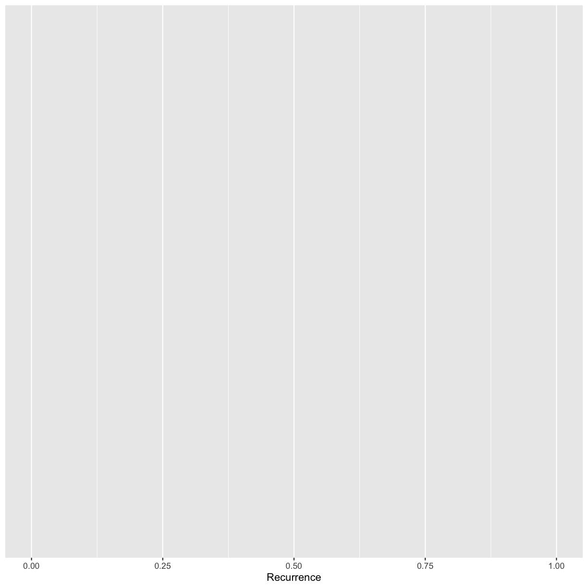

To display the x-axis as categorical instead of decimal values, re-assign
Recurrence as a factor variable.

~~~
blood$Recurrence <- as.factor(blood$Recurrence)
~~~
{: .language-r}

We don't see our data yet. `ggplot` needs to know what kind of plot to make. We
provide a `geom` layer to tell `ggplot` that we want a bar plot showing the 
numbers in each category. Bar charts are good for displaying numbers represented
in each category. They are *not* good for showing differences in means between
groups. For more on this, see Nature Methods 
[Kick the bar chart habit](https://www.nature.com/articles/nmeth.2837).

~~~
# add a geometry layer
# by default the stat layer for geom_bar will count values
ggplot(data =  blood, mapping = aes(x = Recurrence)) + geom_bar()
~~~
{: .language-r}

Something to think about: we have highly unbalanced classes. This might be
something to think about when you fit models and only look at blind performance
metrics. Imagine your data has 100 patients, 99 healthy and 1 sick. If the model
classifies them as healthy *every time*, it's still 99% accurate. This is not
good for the 1 person who is sick and needs treatment. 

## Geometries

We'll explore some of the other `geoms` in `ggplot`. The kind of variable
determines what kind of `geom` or plot type you should use.

### Univariate

#### Continuous

For a single continuous variable, use a histogram to show the distribution of 
the data. Make a histogram of the age distribution.

~~~
ggplot(blood, aes(x = Age)) + geom_histogram()
~~~
{: .language-r}

~~~
`stat_bin()` using `bins = 30`. Pick better value with `binwidth`.
~~~
{: .output}

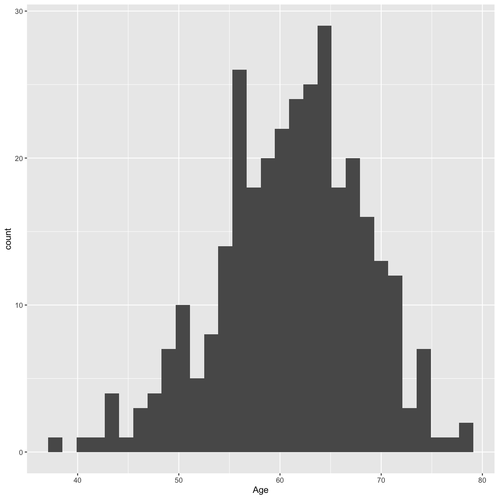

Try a smaller number of bins to smooth out the histogram.

~~~
ggplot(blood, aes(x = Age)) + geom_histogram(bins = 10)
~~~
{: .language-r}

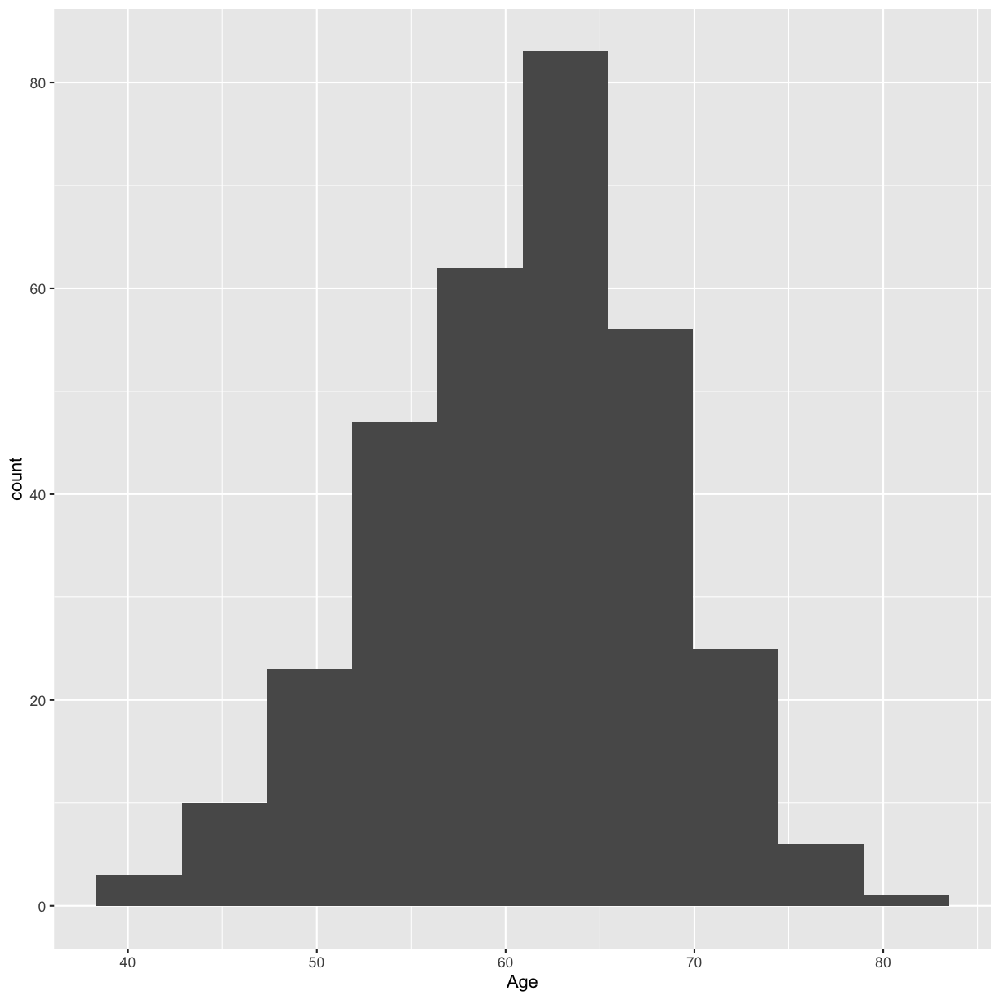

### Bivariate

Boxplots and scatterplots are good ways to visualize two different variables.
The `TVol` column represents the Tumor volume as an ordinal variable

- 1 = Low
- 2 = Medium
- 3 = Extensive

However, the way it is encoded in the dataset is as a (discrete) numeric variable, even though it actually represents a categorical variable. If we 
create a boxplot of tumor volume and age, the categories are not represented
separately.

~~~
# Does not show TVol properly
ggplot(blood) + geom_boxplot(aes(x = TVol, y = Age))
~~~
{: .language-r}

~~~
Warning: Continuous x aesthetic -- did you forget aes(group=...)?
~~~
{: .error}

~~~
Warning: Removed 6 rows containing missing values (stat_boxplot).
~~~
{: .error}

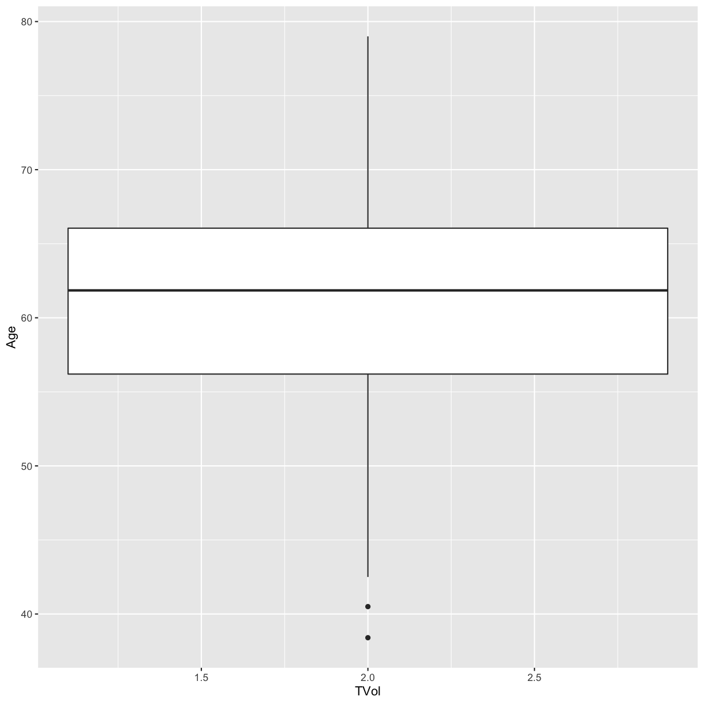

To convert the numeric column (or any column) into a categorical **factor** we can use the `as.factor` function.

~~~
# box plot for each value of TVol as a factor
blood$TVol <- as.factor(blood$TVol)
ggplot(blood) + geom_boxplot(aes(x = TVol, y = Age))
~~~
{: .language-r}

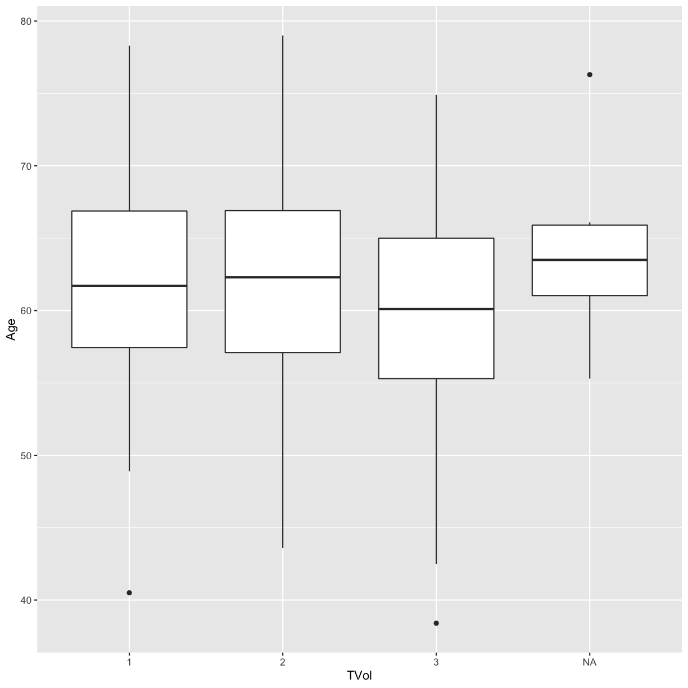

We can also use a violin plot, to better show the distribution of the dataset,
instead of using a boxplot.

And we can also overlay a different geometry on top. In this example, layer 
the data points on top of the violin plots with `geom_point`.

~~~
ggplot(blood) + 
  geom_violin(aes(x = TVol, y = Age)) +
  geom_point(aes(x = TVol, y = Age))
~~~
{: .language-r}

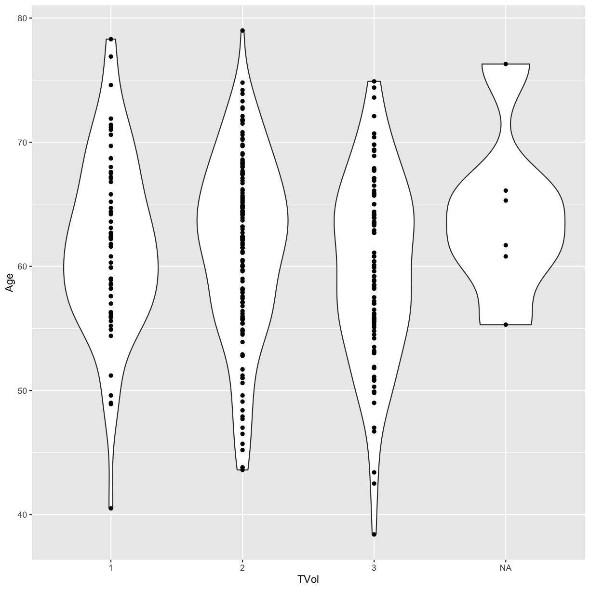

Jitter the points so that they are easier to distinguish from one another.

~~~
ggplot(blood) +
  geom_violin(aes(x = TVol, y = Age)) +
  geom_jitter(aes(x = TVol, y = Age))
~~~
{: .language-r}

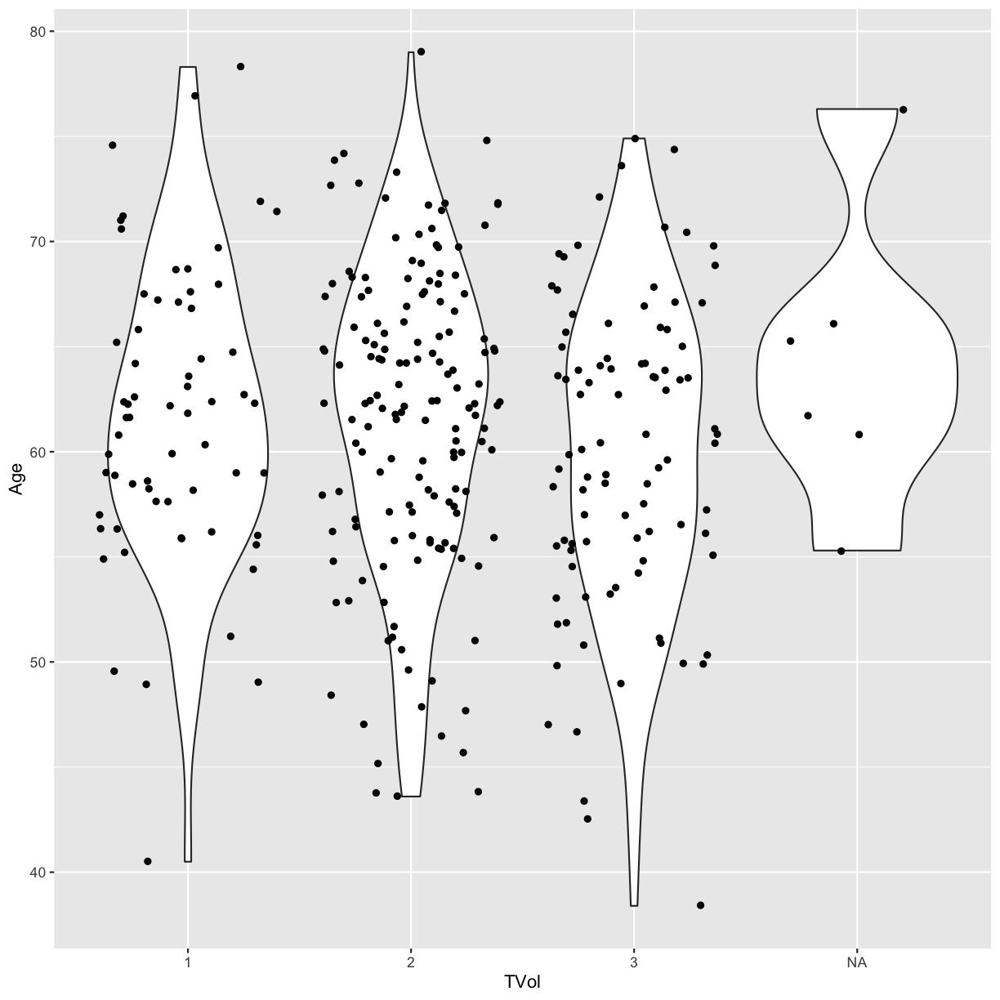

We can move around our data layers to save some typing,
and have the geometry layer use the same data and mapping layer. If the mapping
function `aes` is located within the call to `ggplot`, every succeeding layer
will inherit this mapping.

~~~
ggplot(blood, aes(x = TVol, y = Age)) +
  geom_violin() +
  geom_jitter()
~~~
{: .language-r}

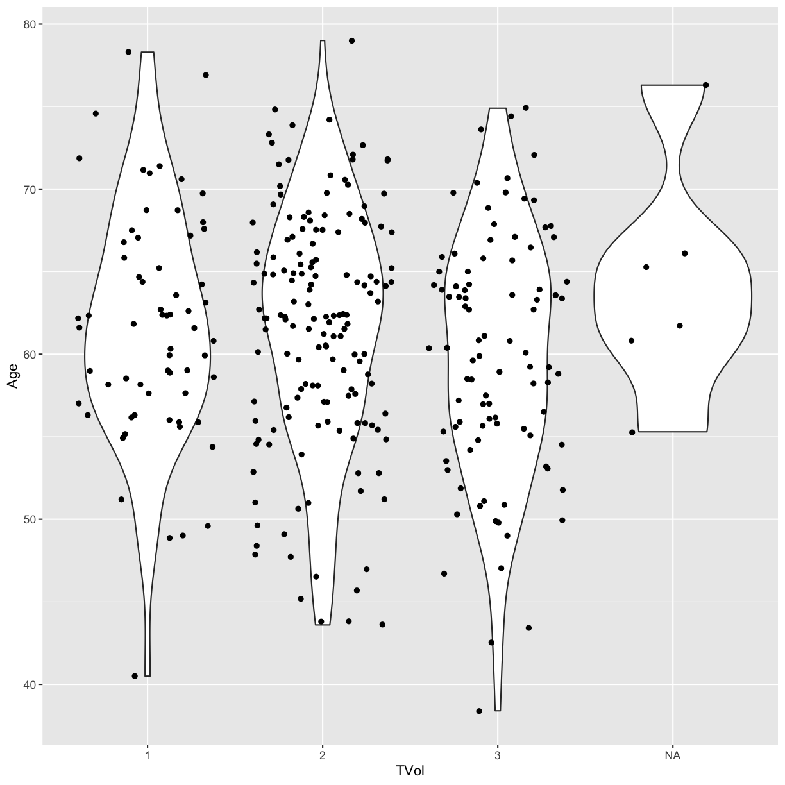

## Other Aesthetic mappings

We can also set other aesthetic mappings, e.g., color

- `PVol`: Prostate volume in grams (g)
- `PreopPSA`: Preoperative prostate specification antigen (PSA) in ng/mL
- `sGS`: Surgical Gleason score
  - 1 = Not assigned
  - 2 = No residual disease or score 0-6
  - 3 = Score 7
  - 4 = Score 8-10

~~~
ggplot(blood) +
  geom_point(aes(x = PVol, y = PreopPSA, color = sGS))
~~~
{: .language-r}

~~~
Warning: Removed 11 rows containing missing values (geom_point).
~~~
{: .error}

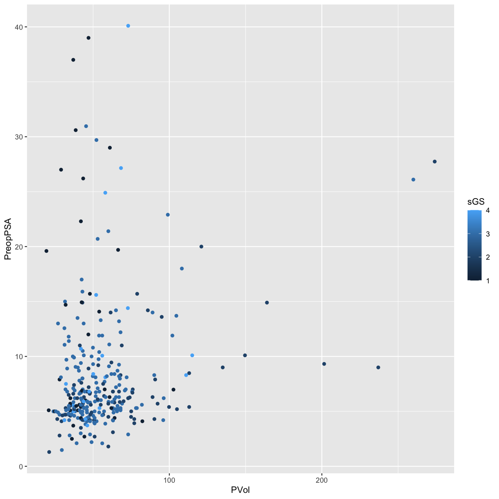

Again, we have a numeric variable that is really an ordinal categorical 
variable, not a continuous variable. We can convert it to a factor with 
`as.factor`.

~~~
ggplot(blood) +
  geom_point(aes(x = PVol, y = PreopPSA, color = as.factor(sGS)))
~~~
{: .language-r}

~~~
Warning: Removed 11 rows containing missing values (geom_point).
~~~
{: .error}

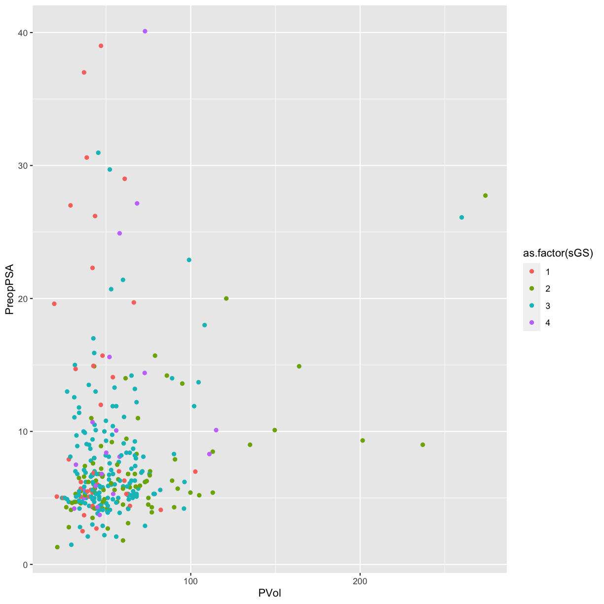

Now the surgical Gleason score appears as discrete colored categories.

## Facets

Facets allow us to re-plot the same figure by separate groups. Think of this as
the `group_by` version for plotting. Here separate panels display the red blood
cell storage duration group.

- `RBC.Age.Group`: RBC storage duration group
  - 1 = less than or equal to 13 days (younger)
  - 2 = 13-18 days (middle)
  - 3 = greater than or equal to 18 days (older)

~~~
# use facet wrap for a single variable
ggplot(blood) +
  geom_point(aes(x = PVol, y = PreopPSA, color = as.factor(sGS))) +
  facet_wrap(~ RBC.Age.Group)
~~~
{: .language-r}

~~~
Warning: Removed 11 rows containing missing values (geom_point).
~~~
{: .error}

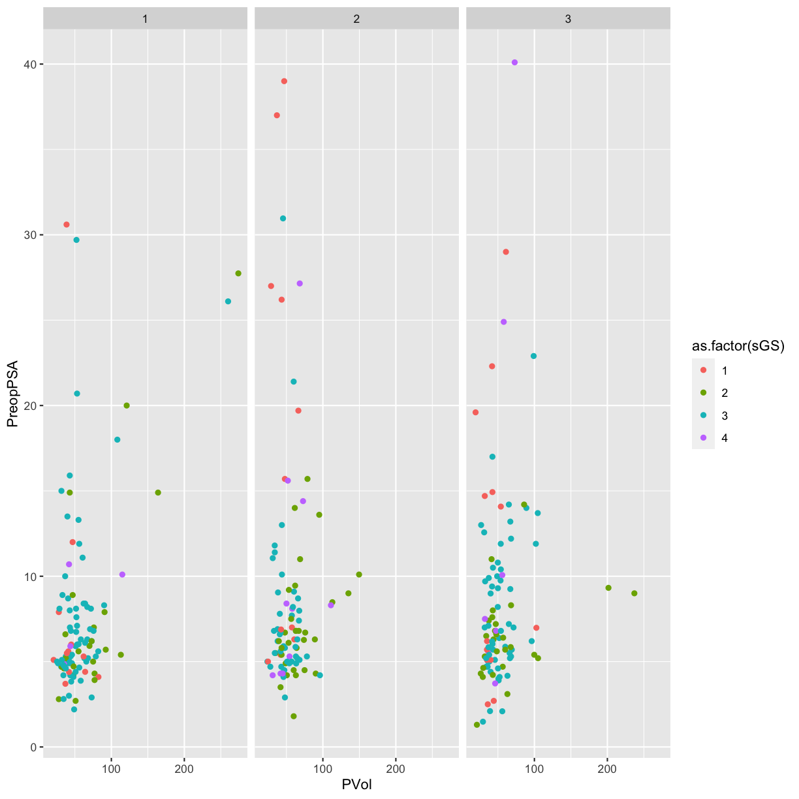

We can also create a grid of panels (facets) colored by family history of 
disease (`FamHx`) and grouped by `RBC.Age.Group` and `Recurrence`. Zeroes 
represent no family history or no recurrence. The categories 1, 2 and 3 for
RBC storage duration group are as listed above (younger, middle, older).

~~~
# use facet grid for 2 variables
ggplot(blood) +
  geom_point(aes(x = PVol, y = PreopPSA, color = as.factor(FamHx))) +
  facet_grid(RBC.Age.Group ~ Recurrence)
~~~
{: .language-r}

~~~
Warning: Removed 11 rows containing missing values (geom_point).
~~~
{: .error}

We can make this a bit easier to interpret by adding axis and legend labels.
Since this involves a lot of typing, save the plot as an object named `g`.

~~~
# use facet grid for 2 variables
g <- ggplot(blood) +
  geom_point(aes(x = PVol, y = PreopPSA, color = as.factor(FamHx))) +
  facet_grid(RBC.Age.Group ~ Recurrence) +
  labs(x = "Prostate volume (g)",
       y = "Preoperative PSA (ng/mL)",
       color = "Family history",
       title = "Recurrence by RBC age group")
~~~
{: .language-r}

## Themes

Themes customize the non-data parts of your plots and come in many different
styles. The minimal theme is clean and spare. Add it to the plot we
saved.

~~~
g + theme_minimal()
~~~
{: .language-r}

~~~
Warning: Removed 11 rows containing missing values (geom_point).
~~~
{: .error}

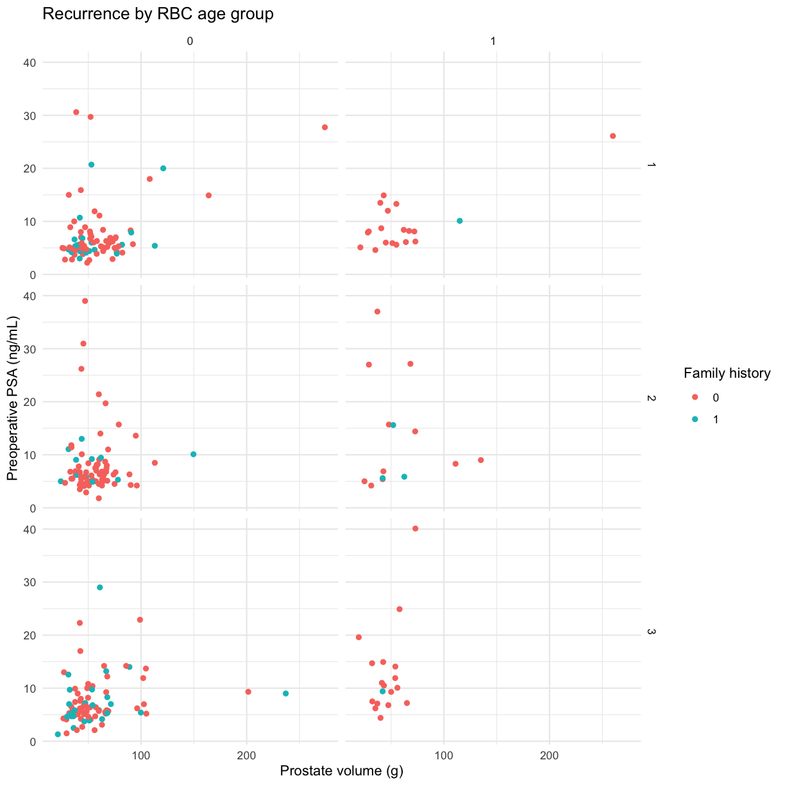

The `ggthemes` package extends themes from `ggplot`. Install the `ggthemes`
package and load the library.

~~~
library(ggthemes)
~~~
{: .language-r}

Style the plot after the Wall Street Journal theme.

~~~
g + theme_wsj()
~~~
{: .language-r}

~~~
Warning: Removed 11 rows containing missing values (geom_point).
~~~
{: .error}

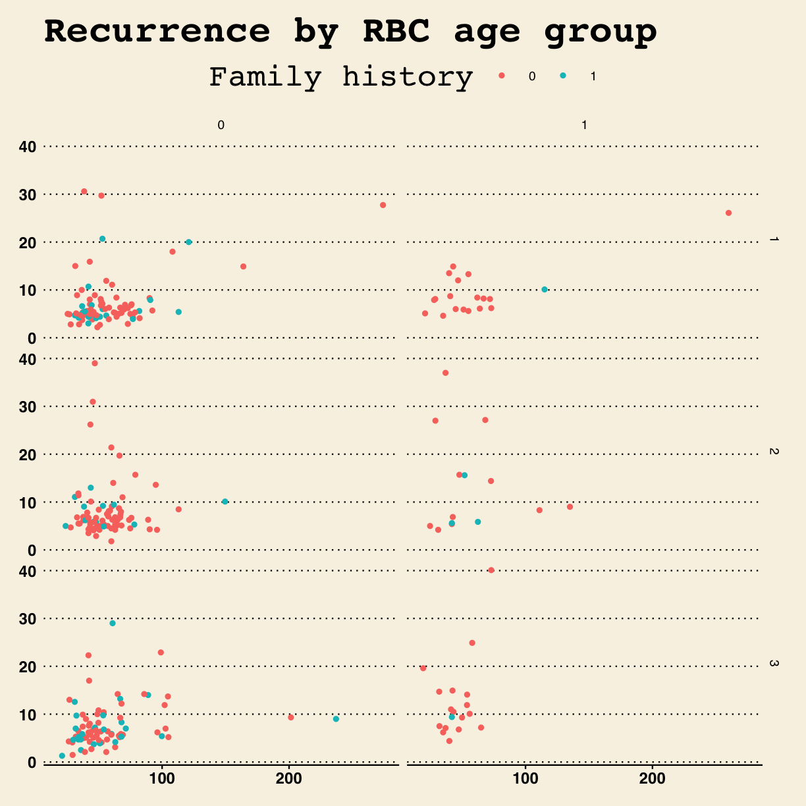

Try Nate Silver's FiveThirtyEight style.

~~~
g + theme_fivethirtyeight()
~~~
{: .language-r}

~~~
Warning: Removed 11 rows containing missing values (geom_point).
~~~
{: .error}

This style looks like an Excel spreadsheet.

~~~
g + theme_excel()
~~~
{: .language-r}

~~~
Warning: Removed 11 rows containing missing values (geom_point).
~~~
{: .error}

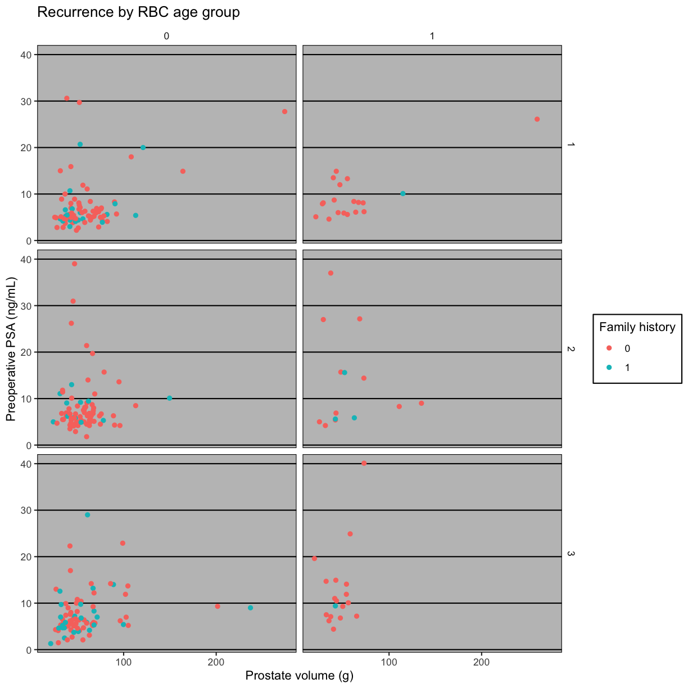

> ## Exercise
> 1. Load the cytomegalovirus dataset from the `medicaldata` package by running
> the code above. This dataset contains measurements from 64 patients who 
> underwent hematopoietic stem cell transplant. [This data dictionary](../files/Cytomegalovirus Data Dictionary.pdf) describes 
each variable in the dataset.
> 2. Create a bar chart of the `cmv` response variable
>
> 
> ~~~
> ggplot(data = cytomegalovirus) +
> ______(aes(x = ______))
> ~~~
> {: .language-r}
>
> 3. bar plot of `prior.transplant`, colored by `cmv` values
> 
> ~~~
> ggplot(______, aes(as.factor(______))) +  
> geom_bar(aes(fill = as.factor(______)))
> ~~~
> {: .language-r}
> 4. facet by both `donor.cmv` and `recipient.cmv`
> 
> ~~~
> ggplot(data = cytomegalovirus, aes(as.factor(prior.transplant))) +  
> geom_bar(aes(fill = as.factor(cmv))) +  
> ______(______ ~ ______)
> ~~~
> {: .language-r}
> 
> >
> > ## Solution
> > 
> > 
> > ~~~
> > ggplot(data = cytomegalovirus) +  
> > geom_bar(aes(x = cmv))
> > ~~~
> > {: .language-r}
> > 
> > 
> > 
> > ~~~
> > ggplot(data = cytomegalovirus, aes(as.factor(prior.transplant))) +  
> > geom_bar(aes(fill = as.factor(cmv)))
> > ~~~
> > {: .language-r}
> > 
> > 
> > 
> > ~~~
> > ggplot(data = cytomegalovirus, aes(as.factor(prior.transplant))) +  
> > geom_bar(aes(fill = as.factor(cmv))) +  
> > facet_grid(donor.cmv ~ recipient.cmv)
> > ~~~
> > {: .language-r}
> > 
> > 
> >
> {: .solution}
{: .challenge}

## Additional Resources
- Publication Quality Graphics with R
  - https://smcclatchy.github.io/r-pub-quality-graphics/
- Ggplot2 reference
  - https://ggplot2.tidyverse.org/reference/index.html
- R Graphics Cookbook
  - 1st edition: http://www.cookbook-r.com/Graphs/
  - 2nd edition: https://r-graphics.org/
- Thomas Lin Pedersen ggplot workshop
  - Slides: https://github.com/thomasp85/ggplot2_workshop
  - Part 1: https://www.youtube.com/watch?v=h29g21z0a68
  - Part 2: https://www.youtube.com/watch?v=0m4yywqNPVY
