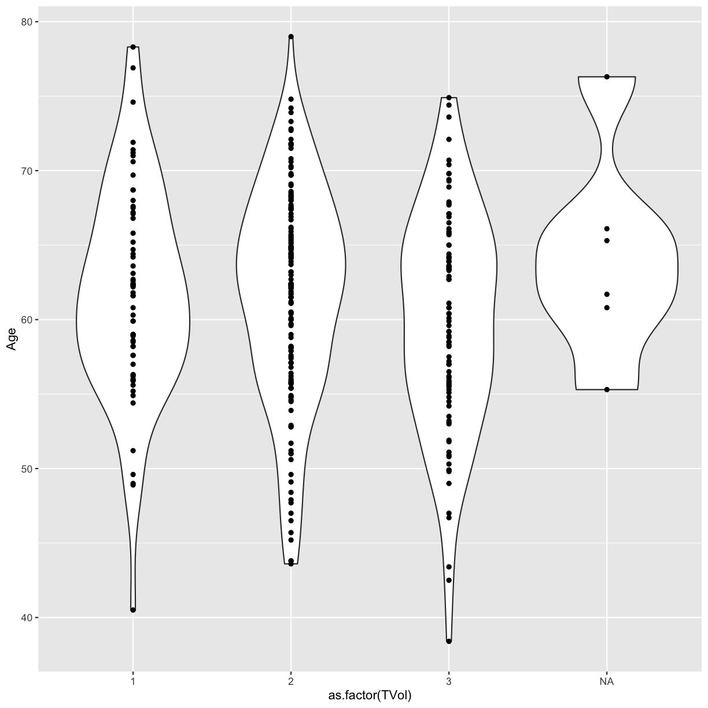
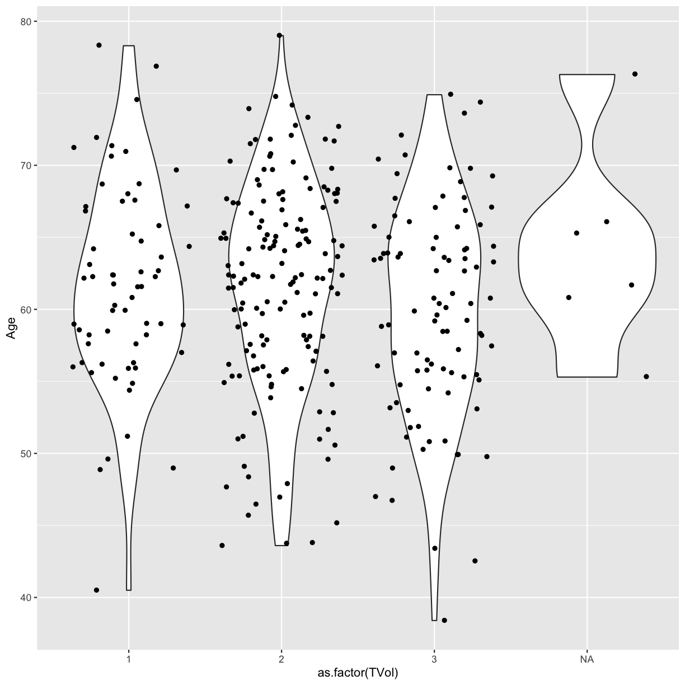
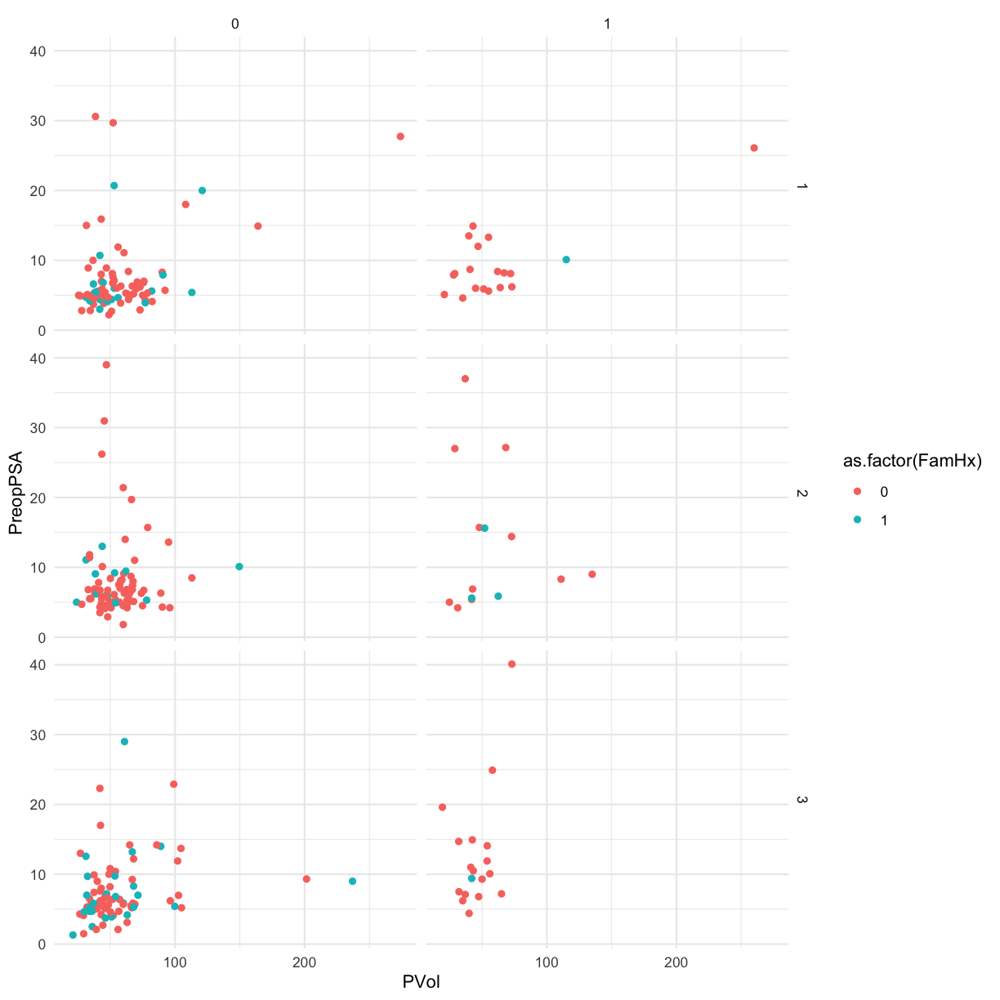

---
# Please do not edit this file directly; it is auto generated.
# Instead, please edit 15-visualization.md in _episodes_rmd/
source: Rmd
title: "Data visualization"
teaching: 0
exercises: 0
questions:
- "How do I visualize data in R?"
objectives:
- "Explore differences between continuous, discrete, nominal, ordinal, and binary data values."
- "Learn to implement a grammar of graphics."
- "Explore plots for different kinds of data values."
- "Build a plot layer by layer."
keypoints:
- ""
- ""
---

# Visualization (Intro)

## Introduction {#vis-intro-intro}

~~~
library(tidyverse)
library(ggplot2)
library(medicaldata)
~~~
{: .language-r}

[Blood storage dataset description](https://github.com/higgi13425/medicaldata/blob/master/description_docs/blood_storage_desc.pdf)

> [A retrospective cohort study of] 316 men who had undergone radical prostatectomy and recieved tranfusion during or within 30 days of the surgical prodedure
> and had available PSA follow-up data.
> The outcome [of interest] was time to biochemical cancer recurrence.
> Study evaluated the association between red blood cells storage duration and biochemical prostate cancer recurrence after radical prostatectomy.
> Specifically, tested was the hypothesis that perioperative transfution of allogenetic RBCs stored for a prolonged period is associated with earlier biochemical recurrence of prostate cancer after prostatectomy.

Download the blood storage data by [clicking the **Download** button here](https://github.com/higgi13425/medicaldata/blob/master/data/blood_storage.rda). This will load the data directly into RStudio. Check your Environment tab at upper right to see a new data object called `blood_storage`.

~~~
head(blood_storage) # use head to look at the first 6 rows
~~~
{: .language-r}

~~~
  RBC.Age.Group Median.RBC.Age  Age AA FamHx  PVol TVol T.Stage bGS BN+
1             3             25 72.1  0     0  54.0    3       1   3   0
2             3             25 73.6  0     0  43.2    3       2   2   0
3             3             25 67.5  0     0 102.7    1       1   3   0
4             2             15 65.8  0     0  46.0    1       1   1   0
5             2             15 63.2  0     0  60.0    2       1   2   0
6             3             25 65.4  0     0  45.9    2       1   1   0
  OrganConfined PreopPSA PreopTherapy Units sGS AnyAdjTherapy AdjRadTherapy
1             0    14.08            1     6   1             0             0
2             1    10.50            0     2   3             0             0
3             1     6.98            1     1   1             0             0
4             1     4.40            0     2   3             0             0
5             1    21.40            0     3   3             0             0
6             0     5.10            0     1   3             0             0
  Recurrence Censor TimeToRecurrence
1          1      0             2.67
2          1      0            47.63
3          0      1            14.10
4          0      1            59.47
5          0      1             1.23
6          0      1            74.70
~~~
{: .output}

~~~
class(blood_storage)
~~~
{: .language-r}

~~~
[1] "data.frame"
~~~
{: .output}

~~~
# get just the column names for a dataset
names(blood_storage)
~~~
{: .language-r}

~~~
 [1] "RBC.Age.Group"    "Median.RBC.Age"   "Age"              "AA"              
 [5] "FamHx"            "PVol"             "TVol"             "T.Stage"         
 [9] "bGS"              "BN+"              "OrganConfined"    "PreopPSA"        
[13] "PreopTherapy"     "Units"            "sGS"              "AnyAdjTherapy"   
[17] "AdjRadTherapy"    "Recurrence"       "Censor"           "TimeToRecurrence"
~~~
{: .output}

## Data Types

While exploring a dataset, you want to know what each variable's role in the analysis will be.

- What is the variable (i.e., column) of interest?
  - response, dependent, y, outcome
- which are your predictor variables?
  - predictor, independent variable, x

For each variable, you want to know what possible values it can take on.

The type of information a variable holds will dictate the summary statistics you can make,
the visualizations you can create,
and the models you can fit.

Ordinal and discrete variables should be converted into `factor` variables in R.
A `factor` is R's way of naming a **categorical** variable.
This is different from a **character string**, e.g., a person's name.

~~~
recurrence_freq <- blood_storage %>%
  group_by(Recurrence) %>%
  summarize(count = n())
recurrence_freq
~~~
{: .language-r}

~~~
# A tibble: 2 x 2
  Recurrence count
       <dbl> <int>
1          0   262
2          1    54
~~~
{: .output}

## Grammar of Graphics

## Data + geometries

~~~
# add a data layer
ggplot(data = blood_storage)
~~~
{: .language-r}

~~~
# add a data later with an asthetic mapping
ggplot(data = blood_storage, mapping = aes(x = Recurrence))
~~~
{: .language-r}

~~~
# add a geometry layer
# by default the stat layer for geom_bar will count values
ggplot(data =  blood_storage, mapping = aes(x = Recurrence)) + geom_bar()
~~~
{: .language-r}

If we have a pre-calculated set of values, we want to tell `geom_bar` to use the `"identity"` statistic.

~~~
recurrence_freq
~~~
{: .language-r}

~~~
# A tibble: 2 x 2
  Recurrence count
       <dbl> <int>
1          0   262
2          1    54
~~~
{: .output}

~~~
ggplot(data = recurrence_freq, mapping = aes(x = Recurrence, y = count)) +
  geom_bar(stat = "identity")
~~~
{: .language-r}

Something to think about: we have highly unbalanced classes.
This might be something to think about when you fit models and only look at blind performance metrics

100 patients, 99 healthy, 1 sick. If my model classifies healthy *every time*.
It's still 99% correct.

### Layer values

If a value does not exist in a particular layer,
ggplot will try to use data from the previous layer

~~~
# everything in the base layer
ggplot(data = recurrence_freq, mapping = aes(x = Recurrence, y = count)) +
  geom_bar(stat = "identity")
~~~
{: .language-r}

~~~
# move astetic mapping to geom layer
ggplot(data = recurrence_freq) +
  geom_bar(mapping = aes(x = Recurrence, y = count), stat = "identity")
~~~
{: .language-r}

~~~
# move data to geom layer
ggplot() +
  geom_bar(data = recurrence_freq, mapping = aes(x = Recurrence, y = count), stat = "identity")
~~~
{: .language-r}

This means we can add more layers with different data sets if we want to.

## Geometries

### Univariate

#### Continuous

~~~
ggplot(blood_storage, aes(x = Age)) + geom_histogram()
~~~
{: .language-r}

~~~
`stat_bin()` using `bins = 30`. Pick better value with `binwidth`.
~~~
{: .output}

~~~
ggplot(blood_storage, aes(x = Age)) + geom_histogram(bins = 10)
~~~
{: .language-r}

### Bivariate

The `TVol` column represents the Tumor volume as an ordinal variable

- 1 = Low
- 2 = Medium
- 3 = Extensive

However, the way it is encoded in the dataset is as a (discrete) numeric variable,
even though it actually represents a categorical variable.
To convert the numeric column (or any column) into a categorical **factor** we can use the `as.factor` function.

~~~
# Does not show TVol properly
ggplot(blood_storage) + geom_boxplot(aes(x = TVol, y = Age))
~~~
{: .language-r}

~~~
Warning: Continuous x aesthetic -- did you forget aes(group=...)?
~~~
{: .error}

~~~
Warning: Removed 6 rows containing missing values (stat_boxplot).
~~~
{: .error}

~~~
# please a box plot for each value of TVol as a factor
ggplot(blood_storage) + geom_boxplot(aes(x = as.factor(TVol), y = Age))
~~~
{: .language-r}

We can also use a violin plot, to better show the distribution of the dataset,
instead of using a boxplot.

And we can also overlay a different geometry on top.

~~~
ggplot(blood_storage) + 
  geom_violin(aes(x = as.factor(TVol), y = Age)) +
  geom_point(aes(x = as.factor(TVol), y = Age))
~~~
{: .language-r}

~~~
ggplot(blood_storage) +
  geom_violin(aes(x = as.factor(TVol), y = Age)) +
  geom_jitter(aes(x = as.factor(TVol), y = Age))
~~~
{: .language-r}

We can move around our data layers to save some typing,
and have the geometry layer use the same data and mapping layer.

~~~
ggplot(blood_storage, aes(x = as.factor(TVol), y = Age)) +
  geom_violin() +
  geom_jitter()
~~~
{: .language-r}

## Other Astetic mappings

We can also set other asthetic mappings, e.g., color

- `PVol`: Prostate volume in grams (g)
- `PreopPSA`: Preoperative prostate specification antigen (PSA) in ng/mL
- `sGS`: Surgical Gleason score
  - 1 = Not assigned
  - 2 = No residual disease or score 0-6
  - 3 = Score 7
  - 4 = Score 8-10

~~~
ggplot(blood_storage) +
  geom_point(aes(x = PVol, y = PreopPSA, color = sGS))
~~~
{: .language-r}

~~~
Warning: Removed 11 rows containing missing values (geom_point).
~~~
{: .error}

Again, we have a numeric variable that is really an ordinal categorical variable

~~~
ggplot(blood_storage) +
  geom_point(aes(x = PVol, y = PreopPSA, color = as.factor(sGS)))
~~~
{: .language-r}

~~~
Warning: Removed 11 rows containing missing values (geom_point).
~~~
{: .error}

## Facets

Facets allow us to re-plot the same figure by separate groups.
Think of this as the `group_by` version for plotting.

~~~
# use facet wrap for a single variable
ggplot(blood_storage) +
  geom_point(aes(x = PVol, y = PreopPSA, color = as.factor(sGS))) +
  facet_wrap(~ RBC.Age.Group)
~~~
{: .language-r}

~~~
Warning: Removed 11 rows containing missing values (geom_point).
~~~
{: .error}

~~~
# use facet grid for 2 variables
ggplot(blood_storage) +
  geom_point(aes(x = PVol, y = PreopPSA, color = as.factor(FamHx))) +
  facet_grid(RBC.Age.Group ~ Recurrence)
~~~
{: .language-r}

~~~
Warning: Removed 11 rows containing missing values (geom_point).
~~~
{: .error}

## Themes

~~~
g <- ggplot(blood_storage) +
  geom_point(aes(x = PVol, y = PreopPSA, color = as.factor(FamHx))) +
  facet_grid(RBC.Age.Group ~ Recurrence)
g
~~~
{: .language-r}

~~~
Warning: Removed 11 rows containing missing values (geom_point).
~~~
{: .error}

~~~
g + theme_minimal()
~~~
{: .language-r}

~~~
Warning: Removed 11 rows containing missing values (geom_point).
~~~
{: .error}

Using ggthemes

~~~
library(ggthemes)
~~~
{: .language-r}

~~~
g + theme_wsj()
~~~
{: .language-r}

~~~
Warning: Removed 11 rows containing missing values (geom_point).
~~~
{: .error}

~~~
g + theme_fivethirtyeight()
~~~
{: .language-r}

~~~
Warning: Removed 11 rows containing missing values (geom_point).
~~~
{: .error}

~~~
g + theme_excel()
~~~
{: .language-r}

~~~
Warning: Removed 11 rows containing missing values (geom_point).
~~~
{: .error}

> ## Exercise
> 1. Load the 
> [cytomegalovirus dataset](https://github.com/higgi13425/medicaldata/blob/master/data/cytomegalovirus.rda) 
> in the same way that you downloaded the blood storage data and loaded it into RStudio.
> 2. Bar chart of the `cmv` response variable
> 
> 
> ~~~
> ggplot(cmv) +
> ____(aes(x = ____))
> ~~~
> {: .language-r}
> 
> 3. bar plot of `prior.transplant`, colored by `cmv` values
> 
> ~~~
> ggplot(____, aes(as.factor(____))) +  
> geom_bar(aes(fill = as.factor(____)))
> ~~~
> {: .language-r}
> 4. facet by both `donor.cmv` and `recipient.cmv`
> 
> ~~~
> ggplot(cmv, aes(as.factor(prior.transplant))) +  
> geom_bar(aes(fill = as.factor(cmv))) +  
> ____(____ ~ ____)
> ~~~
> {: .language-r}
> 
> > ## Solution
> > 
> > ~~~
> > ggplot(cmv) +  
> > geom_bar(aes(x = cmv))
> > ~~~
> > {: .language-r}
> > 
> > 
> > 
> > ~~~
> > Error in ggplot(cmv): object 'cmv' not found
> > ~~~
> > {: .error}
> > 
> > 
> > 
> > ~~~
> > ggplot(cmv, aes(as.factor(prior.transplant))) +  
> > geom_bar(aes(fill = as.factor(cmv)))
> > ~~~
> > {: .language-r}
> > 
> > 
> > 
> > ~~~
> > Error in ggplot(cmv, aes(as.factor(prior.transplant))): object 'cmv' not found
> > ~~~
> > {: .error}
> > 
> > 
> > 
> > ~~~
> > ggplot(cmv, aes(as.factor(prior.transplant))) +  
> > geom_bar(aes(fill = as.factor(cmv))) +  
> > facet_grid(donor.cmv ~ recipient.cmv)
> > ~~~
> > {: .language-r}
> > 
> > 
> > 
> > ~~~
> > Error in ggplot(cmv, aes(as.factor(prior.transplant))): object 'cmv' not found
> > ~~~
> > {: .error}

## Additional Resources

- Ggplot2 reference
  - https://ggplot2.tidyverse.org/reference/index.html
- R Graphics Cookbook
  - 1st edition: http://www.cookbook-r.com/Graphs/
  - 2nd edition: https://r-graphics.org/
- Thomas Lin Pedersen ggplot workshop
  - Slides: https://github.com/thomasp85/ggplot2_workshop
  - Part 1: https://www.youtube.com/watch?v=h29g21z0a68
  - Part 2: https://www.youtube.com/watch?v=0m4yywqNPVY
