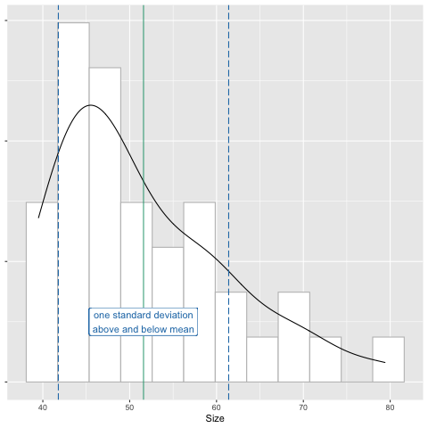

```{r, include=FALSE}
source("../bin/chunk-options.R")
knitr_fig_path("12-")
```

# Descriptive Calculations

## Building the pipeline

New script, clear your environment, re-load your libraries

```{r, message=FALSE}
library(tidyverse)
```

Load the filtered data set created previously that contains days 0 or 13 only. 

```{r, message=FALSE}
tumor_subset <- read_csv("../data/tumor_filtered.csv")
```

Have a look at the data subset.

```{r}
tumor_subset
```

## Summary statistics
Descriptive statistics summarize and organize characteristics of a data set. The 
first step of statistical analysis is to describe characteristics of the 
responses, such as the average of one variable (e.g., age), or the relation 
between two variables (e.g., age and weight). Inferential statistics, the next 
step in an analysis, helps to determine whether data confirms or refutes your 
hypothesis and whether it is generalizable to a larger population. We focus on 
descriptive statistics here with some statistical summaries of the filtered 
data. `pull` extracts a single column of data in the same way the the `$` 
operator specifies a column. `pull` is a verb though, and reads more easily in 
piped operations like this one.

Filter out observations for day 0 only and look at the Size variable.

```{r}
tumor_subset %>%
  filter(Day == 0) %>%
  pull(Size)
```

The mean is one statistical summary showing the _central tendency_ of the data. 
It is the most commonly used measure of central tendency, however, it is 
sensitive to _outliers_. Extreme values pull the mean toward them and have a 
disproportional effect on its value. The median value is another measure of 
central tendency as well as a measure of _position_. This value lies directly in 
the center of the ordered data with half of the values above and half below it. 
It is not sensitive to extreme values - only its rank in the ordered values is 
considered. In the plot below, the median lies directly at the center of the
`r dim(tumor_subset)[1]` data values when they are ordered from smallest to 
largest.


The distribution of tumor sizes shows a right skew, in which the mean is pulled
to the right of the median by a few very large tumors. Values on the x-axis with 
a greater density on the y-axis (e.g. between 42-45 mm<sup>3</sup>) have a 
higher probability of occurring, while those with a lower density (e.g. between 
71-74 mm<sup>3</sup>) have a low probability of occurring. 

## The mean
The mean of the distribution is the average of all the values that make up that 
distribution. In the case of tumor size, the mean for day 0 is summarized as: 

```{r}
tumor_subset %>%
  filter(Day == 0) %>%
  pull(Size) %>%
  mean()
```

The mean is also known as the expectation or expected value of a variable, <i>E()</i>. The expected value of tumor sizes is expressed as <i>E(y)</i>:

$$E(y) = \frac{1}{n} \left( \sum_{i=1}^n y_{i} \right)$$

where $n = 60$.

Find mean tumor size for day 0 for group 1.

```{r}
tumor_subset %>%
  filter(Group == 1, Day == 0) %>%
  pull(Size) %>%
  mean()
```

Find mean tumor size for day 0 for group 2.

```{r}
tumor_subset %>%
  filter(Group == 2, Day == 0) %>%
  pull(Size) %>%
  mean()
```

Find mean tumor size for day 0 for group 3.

```{r}
tumor_subset %>%
  filter(Group == 3, Day == 0) %>%
  pull(Size) %>%
  mean()
```

Find mean tumor size for day 0 for group 4.

```{r}
tumor_subset %>%
  filter(Group == 4, Day == 0) %>%
  pull(Size) %>%
  mean()
```

What are the unique group numbers?

```{r}
tumor_subset %>%
  pull(Group) %>%
  unique()
```

## The variance
The *variance* is the average *squared* difference between values in the 
distribution and the mean of the distribution. This is a mouthful, so it is 
useful to look at the equation of variance. The variance is expressed as $V()$:  

$$V(y) = E( (y - E(y))^2 )$$

Breaking this down, we see that the variance is calculated using:
* $y - E(y)$, i.e. the difference between an observed tumor size and the mean 
tumor size.  
* $(y - E(y))^2$, i.e. the squared difference between an observed tumor size and 
the mean tumor size.  
* $E( (y - E(y))^2 )$, i.e. the expectation of this squared difference.

Why are we interested in this value? We are mainly interested in the variance
because it allows us to calculate the standard deviation, which can be 
interpreted on the original scale. Let's look at this below.

## The standard deviation
The *standard deviation* of a distribution is the *square root* of the variance.
The standard deviation is expressed as $\sigma_y$:

$$\sigma_y = \sqrt{V(y)}$$

The standard deviation is interpreted as a measure of the difference between
values in the distribution and the mean of the distribution. A higher standard 
deviation indicates that the spread around the mean is greater. There is no 
"good" or "bad" standard deviation - its purpose is to give us an idea of the 
spread of observations in the population. 

## Groupby operations
Use `group_by` and `summarize` to view group means for all groups.

```{r}
tumor_subset %>%
  filter(Day == 0) %>%
  group_by(Group) %>%
  summarize(avg_size = mean(Size))
```

> ## Comparing mean with median
>
> Repeat the previous summary substituting the median for the mean.  
> 1). What do you notice when you compare the mean and median values for each 
> group?   
> 2). What would cause the differences in the mean and median values for each 
> group?   
> 3). How might you check your answer to number 2 above? 
> 
> > ## Solution
> >
> > ~~~
> > tumor_subset %>%
> >   filter(Day == 0) %>%
> >   group_by(Group) %>%
> >   summarize(median_size = median(Size))
> > ~~~
> > {: .output}
> >
> > 1). The median values are smaller than the mean values for each group.    
> > 2). Since the median is not sensitive to outliers and is smaller than the 
> > mean for each group, it appears that there are large sizes in each group
> > that pull the mean toward them.   
> > 3) You could list all size values for each group to see if there are very
> > large values that pull the mean toward them. The mean values are between 48 
> > and 56, so values much above this will strongly influence the mean. You can
> > look at all values by group.
> > ~~~
> > tumor_subset %>%
> > filter(Day == 0) %>%
> > group_by(Group) %>%
> > pull(Size, Group)
> > ~~~
> > {: .output}
> > If you only want to see the maximum value for each group, you can use `max`.
> > ~~~
> > tumor_subset %>%
> > filter(Day == 0) %>%
> > group_by(Group) %>%
> > summarize(max_value = max(Size))
> > ~~~
> > {: .output}
> > Each group has a maximum value well outside of the range of group means.
> {: .solution}
{: .challenge}

Mean and median both summarize the center of the data. Median lies directly at 
center of the ordered data values - it lies at the midpoint of these values and
is a measure of position. 
The _quantile_ defines a specific part of a data set above or below some limit. 
For example, quartiles divide a data set into fourths, and percentiles by 
100ths. The median is the 50th percentile of the data - half lie above this 
value and half below. `quantile` takes an argument `probs` that gives the probability of values falling beneath a specific quantile. For example, `probs = .25` means that 25% of the values will be less than this quantile. This is the first quarter, or quartile, of the data.  

```{r, quantile}
tumor_subset %>% 
  filter(Day == 0) %>% 
  summarize(quartile_1 = quantile(Size, probs = .25))
```


_Standard deviation_ measures the spread of the data. This summary statistic
measures the _dispersion_ or _variability_ of the data. A small standard deviation indicates that data values tend to stay closer to the mean, while a large standard deviation indicates greater spread of data values away from the mean. Measuring standard deviation helps to describe the expected distance between data values. It is also a measure of how representative data values are of the entire distribution. For a normal distribution, 68% of the data values lie within one standard deviation of the mean.  

Find the standard deviation for day 0 for all groups.

```{r, sd}
tumor_subset %>% 
  filter(Day == 0) %>% 
  summarise(sd_size = sd(Size))
```


We can further explore mean, standard deviation, and first quartile by calculating each for groups 1 to 4.

```{r}
tumor_subset %>%
  group_by(Group, Day) %>%
  summarize(avg_size = mean(Size),
            sd_size = sd(Size),
            q1 = quantile(Size, probs = .25)
            )
```

> ## Measures of variability and position
>
> 1). For each day, which  group  has the largest mean tumor size? the largest 
> variability? Which has the smallest mean size? the smallest variability?  
> 2) How confident are you that the mean values represent a "typical" data   
> value? How could you check whether the means represent typical values?  
> 3). For these combinations of group and day, what values do 25% of the data
> values fall under?   
> 
> > ## Solution
> >
> > 1). Group 1 on day 0 has the greatest mean size and standard deviation.  
> > Group 1 on day 13 also has the greatest mean size and standard deviation.  
> > Group 3 on day 0 has the smallest mean size and variability. For day 13  
> > Group 2 has the smallest mean size and variability.  
> > 2). Greater variability means that data values lie farther from the mean, so
> > the mean might not represent a typical data value well. You could make a 
> > histogram and include the mean value. Group 1 means are not the best 
> > representatives.
> > 3). Group 1, day 0: 25% of data values are less than 46.3.   
> > Group 1, day 13: 25% < 1030.4   
> > Group 3, day 0: 25% < 42.875  
> > Group 2, day 13: 25% < 357.225  
> {: .solution}
{: .challenge}

