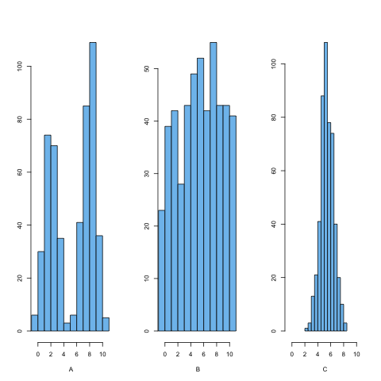
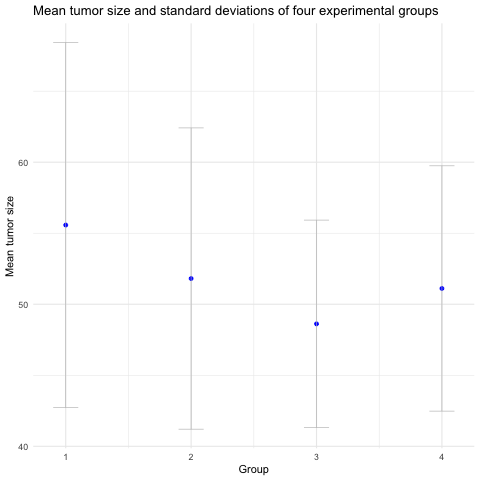

```{r, include=FALSE}
source("../bin/chunk-options.R")
knitr_fig_path("12-")
```

# Descriptive Calculations

## Building the pipeline

New script, clear your environment, re-load your libraries

```{r, message=FALSE}
library(tidyverse)
```

Load the filtered data set created previously that contains days 0 or 13 only. 

```{r, message=FALSE}
tumor_subset <- read_csv("../data/tumor_filtered.csv")
```

Have a look at the data subset.

```{r}
tumor_subset
```

What are the unique group numbers?

```{r}
tumor_subset$Group %>%
  unique()
```

What days are represented?

```{r}
tumor_subset$Day %>%
  unique()
```
## Summary statistics
Descriptive statistics summarize and organize characteristics of a data set. The 
first step of statistical analysis is to describe characteristics of the 
responses, such as the average of one variable (e.g., age), or the relation 
between two variables (e.g., age and weight). Inferential statistics, the next 
step in an analysis, helps to determine whether data confirms or refutes your 
hypothesis and whether it is generalizable to a larger population. We focus on 
descriptive statistics here with some statistical summaries of the filtered 
data. 

What is the mean tumor size for all groups and both days?

```{r}
tumor_subset$Size %>%
  mean()
```

This is not very informative because measurements were taken 13 days apart in
four different treatment groups, so they will vary widely. We can use the 
`range` function to view the minimum and maximum tumor sizes.

```{r}
tumor_subset$Size %>%
  range()
```

`pull` extracts a single column of data in the same way the the `$` 
operator specifies a column. `pull` is a verb though, and reads more easily in 
piped operations like this one.

Filter out observations for day 0 only and look at the Size variable.

```{r}
tumor_subset %>%
  filter(Day == 0) %>%
  pull(Size)
```

The mean is one statistical summary showing the _central tendency_ of the data. 
It is the most commonly used measure of central tendency, however, it is 
sensitive to _outliers_. Extreme values pull the mean toward them and have a 
disproportional effect on its value. The median value is another measure of 
central tendency as well as a measure of _position_. This value lies directly in 
the center of the ordered data with half of the values above and half below it. 
It is not sensitive to extreme values - only its rank in the ordered values is 
considered. In the plot below, the median lies directly at the center of the
`r dim(tumor_subset)[1]` data values when they are ordered from smallest to 
largest.


The distribution of tumor sizes shows a right skew, in which the mean is pulled
to the right of the median by a few very large tumors. Values on the x-axis with 
a greater density on the y-axis (e.g. between 42-45 mm<sup>3</sup>) have a 
higher probability of occurring, while those with a lower density (e.g. between 
71-74 mm<sup>3</sup>) have a low probability of occurring. 

## The mean
The mean of the distribution is the average of all the values that make up that 
distribution. In the case of tumor size, the mean for day 0 is summarized as: 

```{r}
tumor_subset %>%
  filter(Day == 0) %>%
  pull(Size) %>%
  mean()
```

The mean is also known as the expectation or expected value of a variable, 
<i>E()</i>. The expected value of tumor sizes on day 0 is expressed as 
<i>E(y)</i>:

$$E(y) = \frac{1}{n} \left( \sum_{i=1}^n y_{i} \right)$$

where $n = 60$.

Find mean tumor size for day 0 for group 1.

```{r}
tumor_subset %>%
  filter(Group == 1, Day == 0) %>%
  pull(Size) %>%
  mean()
```

Find mean tumor size for day 0 for group 2.

```{r}
tumor_subset %>%
  filter(Group == 2, Day == 0) %>%
  pull(Size) %>%
  mean()
```

Find mean tumor size for day 0 for group 3.

```{r}
tumor_subset %>%
  filter(Group == 3, Day == 0) %>%
  pull(Size) %>%
  mean()
```

Find mean tumor size for day 0 for group 4.

```{r}
tumor_subset %>%
  filter(Group == 4, Day == 0) %>%
  pull(Size) %>%
  mean()
```

## The variance
The *variance* is the average *squared* difference between values in the 
distribution and the mean of the distribution. This is a mouthful, so it is 
useful to look at the equation of variance. The variance is expressed as $V()$:  

$$V(y) = E( (y - E(y))^2 )$$

Breaking this down, we see that the variance is calculated using:
* $y - E(y)$, i.e. the difference between an observed tumor size and the mean 
tumor size.  
* $(y - E(y))^2$, i.e. the squared difference between an observed tumor size and 
the mean tumor size.  
* $E( (y - E(y))^2 )$, i.e. the expectation of this squared difference.

Why are we interested in this value? We are mainly interested in the variance
because it allows us to calculate the standard deviation, which can be 
interpreted on the original scale. Let's look at this below.

## The standard deviation
The *standard deviation* of a distribution is the *square root* of the variance.
The standard deviation is expressed as $\sigma_y$:

$$\sigma_y = \sqrt{V(y)}$$

The standard deviation is interpreted as a measure of the difference between
values in the distribution and the mean of the distribution. A higher standard 
deviation indicates that the spread around the mean is greater. There is no 
"good" or "bad" standard deviation - its purpose is to give us an idea of the 
spread of observations in the population. 


Find the standard deviation of tumor size for day 0 for all groups.

```{r, sd}
tumor_subset %>%
  filter(Group == 2, Day == 0) %>%
  pull(Size) %>%
  mean()

```

> ## Outliers and standard deviation
>
> 1. Do outliers affect the value of the standard deviation? Why or why not?   
> 2. Suppose that your data set has a point that is much lower than the rest. 
> What type of effect (if any) would this have on the value of the standard 
> deviation?  
> a.)  It would make it larger.  
> b.)  It would make is smaller.   
> c.)  It would stay the same.   
> d.)  Unable to be determined.   
> 3. Suppose that your data set has a point that is much higher than the rest.  
> What type of effect (if any) would this have on the value of the standard 
> deviation?  
> a.)  It would make it larger.  
> b.)  It would make is smaller.   
> c.)  It would stay the same.   
> d.)  Unable to be determined.
> 
> > ## Solution
> >
> > 1. Outliers do affect the standard deviation. The sd is computed from the 
> > variance, which is computed from the mean. The mean is sensitive to 
> > outliers, so statistical summaries (e.g. sd) computed from the mean value 
> > will be affected by outliers as well.  
> > 2. a.)  It would make it larger. sd is a measure of spread of the data, so a 
> > low outlier will increase the spread of the data. When a large negative 
> > difference between an observed and the mean tumor size is squared  
> > $(y - E(y))^2 )$, the squared difference becomes a large positive value. The 
> > variance increases as a result and so does standard deviation. 
> > 3. a.)  It would make it larger. sd is a measure of spread of the data, so a 
> > high outlier will increase the spread of the data. When a large positive 
> > difference between an observed and the mean tumor size is squared, the 
> > squared difference becomes a much larger positive value. The variance 
> > increases as a result and so does standard deviation.  
> {: .solution}
{: .challenge}



> ## Distributions and standard deviation
>
> Which of the histograms above has the smallest standard deviation? How can you know?
> 
> > ## Solution
> >
> > Plot C has the smallest standard deviation or narrowest spread. The average 
> > distance of points from the mean is less than in the other histograms. In 
> > histograms A and B, more of the points are a further distance from the mean.  
> {: .solution}
{: .challenge}

## Groups and statistical summaries
Use `group_by` and `summarize` to view group means and standard deviations for 
all groups on day 0.

```{r}
tumor_subset %>%
  filter(Day == 0) %>%
  group_by(Group) %>%
  summarize(avg_size = mean(Size), 
            std_dev = sd(Size))
```

> ## Comparing mean with median
>
> Repeat the previous summary, but add the median in addition to the mean and
> standard deviation.  
> 1). What do you notice when you compare the mean and median values for each 
> group?   
> 2). What would cause the differences in the mean and median values for each 
> group?   
> 3). How might you check your answer to number 2 above? 
> 
> > ## Solution
> >
> > ~~~
> > tumor_subset %>%
> >   filter(Day == 0) %>%
> >   group_by(Group) %>%
> >   summarize(avg_size = mean(Size),  
> >            median_size = median(Size),  
> >            std_dev = sd(Size)  
> >            )
> > ~~~
> > {: .output}
> >
> > 1). The median values are smaller than the mean values for each group.    
> > 2). Since the median is not sensitive to outliers and is smaller than the 
> > mean for each group, it appears that there are large sizes in each group
> > that pull the mean toward them.   
> > 3) You could list all size values for each group to see if there are very
> > large values that pull the mean toward them. The mean values are between 48 
> > and 56, so values much above this will strongly influence the mean. You can
> > look at all values by group.
> > ~~~
> > tumor_subset %>%
> > filter(Day == 0) %>%
> > group_by(Group) %>%
> > pull(Size, Group)
> > ~~~
> > {: .output}
> > If you only want to see the maximum value for each group, you can use `max`.
> > ~~~
> > tumor_subset %>%
> > filter(Day == 0) %>%
> > group_by(Group) %>%
> > summarize(avg_size = mean(Size), max_value = max(Size))
> > ~~~
> > {: .output}
> > Each group has a maximum value well outside of the range of group means.
> {: .solution}
{: .challenge}


> 
> ## Means and error bars
>
> The bar plots above show the means and standard deviations for each group.
> Group means are indicated by the height of the bar, and standard deviations
> for each group shown as an "error bar" extending equally above and below the
> mean value for each group.  
> 1). What information does this plot give you about the experimental groups?    
> 2). What does the error bar tell you about each group?     
> 3). What does the zero at the bottom of each bar mean? Do tumor sizes begin 
> at zero? 
> 
> > ## Solution
> >
> > 1). The top of each bar tells you what the mean tumor size is for each 
> > group. The error bar shows the standard deviation for each group, indicating
> > the spread or variation of the data.  
> > 2). The error bars show that while the means might be different for each 
> > group, but the standard deviations overlap for all groups and as such there 
> > is overlap in the data for all groups. The bars do not indicate error in 
> > measurement.   
> > 3). The zero at the bottom of each bar is meaningless and confusing. Tumor 
> > sizes don't begin at zero, and the bars don't show the range of the data.
> > In fact, the only meaningful part of the bar is the top of it. Everything
> > beneath the top of the bar (the group mean) is wasted ink. 
> > 
> {: .solution}
{: .challenge}

A better way to visualize group means with error bars is with a mean-and-error 
plot with a single point representing the mean and error bars showing standard 
deviation. 


It isn't as visually striking as a bar plot, which is one of the reasons they
aren't often seen. Bar plots are also more common because spreadsheet software like Excel make it easy to make bar plots, but not so easy to visualize means 
and errors in other ways that might be more suitable to the task. For more on
this, see Nature Methods 
[Kick the bar chart habit](https://www.nature.com/articles/nmeth.2837) 
and [Error bars](https://www.nature.com/articles/nmeth.2659).

## Quantiles
Mean and median both summarize the center of the data. Median lies directly at 
center of the ordered data values - it lies at the midpoint of these values and
is a measure of location. 
The _quantile_ defines a specific part of a data set above or below some limit. 
For example, quartiles divide a data set into fourths, and percentiles by 
100ths. The median is the 50th percentile of the data - half lies above this 
value and half below. `quantile` takes an argument `probs` that gives the 
probability of values falling beneath a specific quantile. For example, 
`probs = .25` means that 25% of the values will be less than this quantile. 
This is the first quarter, or quartile, of the data.  

```{r, quantile}
tumor_subset %>% 
  filter(Day == 0) %>% 
  summarize(quartile_1 = quantile(Size, probs = .25))
```

  

We can further explore mean, median, and first quartile by 
calculating each for groups 1 to 4.

```{r}
tumor_subset %>%
  group_by(Group) %>%
  filter(Day == 0) %>%
  summarize(avg_size = mean(Size),
            sd_size = sd(Size),
            median_size = median(Size),
            q1 = quantile(Size, probs = .25)
            )
```

> ## Measures of variability and location
>
> 1). For each day, which  group  has the largest mean tumor size? the largest 
> variability? Which has the smallest mean size? the smallest variability?    
> 2) How confident are you that the mean values represent a "typical" data 
> value? How could you check whether the means represent typical values?    
> 3). For these combinations of group and day, what values do 25% of the data
> values fall under?   
> 
> > ## Solution
> >
> > 1). Group 1 on day 0 has the greatest mean size and standard deviation.    
> > Group 1 on day 13 also has the greatest mean size and standard deviation.  
> > Group 3 on day 0 has the smallest mean size and variability. For day 13  
> > Group 2 has the smallest mean size and variability.   
> > 2). Greater variability means that data values lie farther from the mean, so
> > the mean might not represent a typical data value well. You could make a 
> > histogram and include the mean value. Group 1 means are not the best 
> > representatives.  
> > 3). Group 1, day 0: 25% of data values are less than 46.3.   
> > Group 1, day 13: 25% < 1030.4   
> > Group 3, day 0: 25% < 42.875  
> > Group 2, day 13: 25% < 357.225  
> {: .solution}
{: .challenge}

  
> ## Box plots to visualize data
>
> The box plots above show data for each group.  
> 1). Add the third quartile to the data summary we created earlier (hint: use 
> `quantile`  with the argument `probs = .75`).     
> 2). How do the 1st, 2nd (median), and 3rd quartile values for each group
> compare to the boxplots above?    
> 3). Is the mean value for each group shown in the boxplots?  
> 4). What do you think the lines extending above and below the boxes represent?  
> 5). For group 4, what does the dot near tumor size 70 represent?  
> 6). How do the boxplots compare to the bar plots we saw earlier? What 
> information do they convey or not convey?  
> 
> > ## Solution
> >
> > 1). 
> > ~~~
> > tumor_subset %>%
> >   group_by(Group) %>%
> >   filter(Day == 0) %>%
> >   summarize(avg_size = mean(Size),
> >             sd_size = sd(Size),
> >             median_size = median(Size),
> >             q1 = quantile(Size, probs = .25),
> >             q3 = quantile(Size, probs = .75)
> >             ) 
> > ~~~
> > {: .output}
> > 
> > 2). The 1st and 3rd quartile values for each group are shown as the bottom 
> > and top of each box respectively. The 2nd quartile (median) is shown as a 
> > horizontal bar inside the boxes. The length of the box is called the 
> > the interquartile range or IQR.  
> > 3). The mean value for each group isn't shown in the boxplots.   
> > 4). The lines extending above and below show the data values below the 
> > 1st quartile or above the 3rd quartile (the interquartile range or IQR). The
> > length of these "whiskers" is 1.5 times the interquartile range. For example,
> > the IQR for group 4 is 53.5 - 45.8 = 7.7. The whisker length will be a 
> > maximum of 7.7 * 1.5 = 11.55, as long as there are data points this far away
> > from the 1st and 3rd quartiles. If there aren't any, the whisker goes only
> > as far as there are data points. For group 4, the upper whisker extends 
> > from the 3rd quartile value plus 1.5 * IQR = 53.5 + 11.55 = 65.05.  
> > 5). The dot represents on outlier in group 4. In this case the outlier 
> > lies more than 1.5 * IQR away from the 3rd quartile of the data (65.05). You
> > can use the `max` function to find that the value of this outlier is 69.2.   
> > 
> > ~~~
> > tumor_subset %>%
> > filter(Day == 0) %>%
> > group_by(Group) %>%
> > summarize(max_value = max(Size))
> > ~~~
> > {: .output}
> > 
> > 6). While box plots don't show the mean or standard deviation, they do 
> > show the spread of the data with the length of the boxes and whiskers. There 
> > is no confusion about where the data start (e.g. the values don't start at
> > zero). Since they don't rely on the mean value to convey information, 
> > extreme high or low values are not obscured by the visualization. 
> > 
> {: .solution}
{: .challenge}


There is much more information in a box plot than in a bar chart, and there are 
ways to add in a point and error bars representing the mean. For more on this,
see Nature Methods 
[Visualizing samples with box plots](https://www.nature.com/articles/nmeth.2813).


