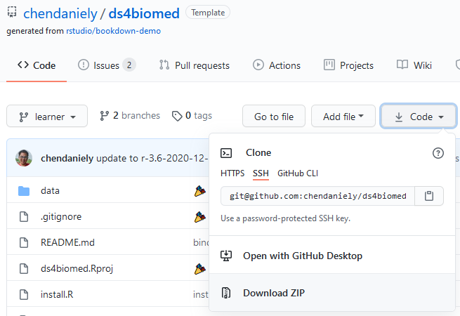
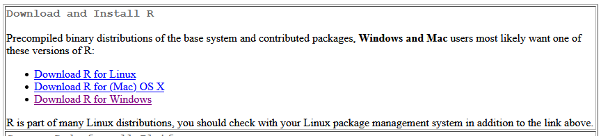
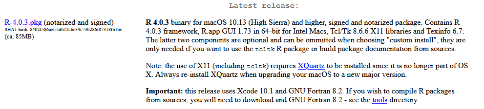
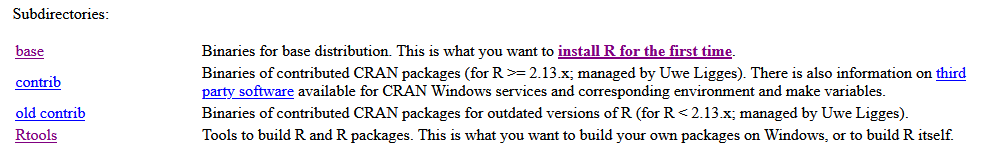
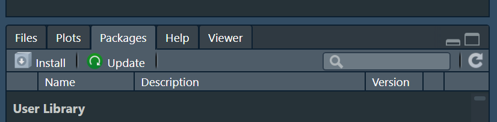
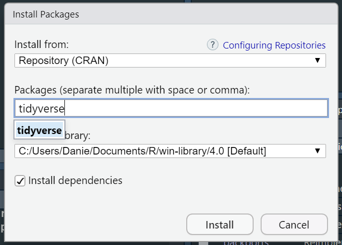
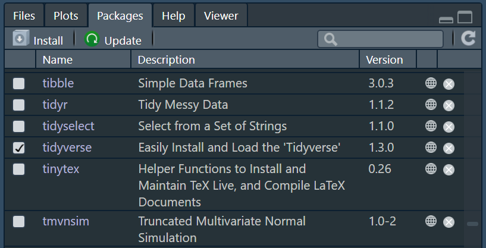



To prepare to follow along, you will need to have
the datasets downloaded and a programming language (e.g., R) installed.

## Datasets {-}

You can find all the datasets needed from the workshop [from the book's GitHub Page](https://github.com/chendaniely/ds4biomed).

1. You can click on the "Code" dropdown and select "Download Zip" to download the data and files for the lesson materials.

    

2. Go to your Downloads folder to locate the `ds4biomed-learner` folder.  
3. Move this folder onto your Desktop and unzip it if it is still zipped.  

## Programming language {-}

R is a programming language that is especially powerful for data exploration, visualization, and statistical analysis. To interact with R, we use RStudio. 

### R {-}

We will be using R and RStudio for the workshop.
If you would like a video installation tutorial,
please see the
[R section of The Carpentries workshop template](https://carpentries.github.io/workshop-template/#r).

The links to install R can be found here: https://cloud.r-project.org/.
Navigate to the correct operating system.

For mac users, download the `.pkg` file under the "Latest release" section

For Windows users, please install both the `base` version as well as `Rtools`.

#### RStudio {-}

After you have installed R, you can install RStudio.
We will use RStudio as the integrated development environment (IDE) to write and work with R code.
Rstudio can be downloaded from the following location: https://rstudio.com/products/rstudio/download/

#### Installing R packages {-}

Start RStudio by double-clicking the icon.
Within RStudio, there will be a "Packages" tab in the bottom right panel.
Click on the "Install" button.

In the pop-up window type in "tidyverse" and click "install".

The Console section of RStudio will begin installing the "tidyverse" package we will be using.

#### Testing your installation {-}

When the installation is finished, you can check if the package was installed properly and will load
by scrolling down the "Packages" tab and clicking the checkbox next to "tidyverse".

